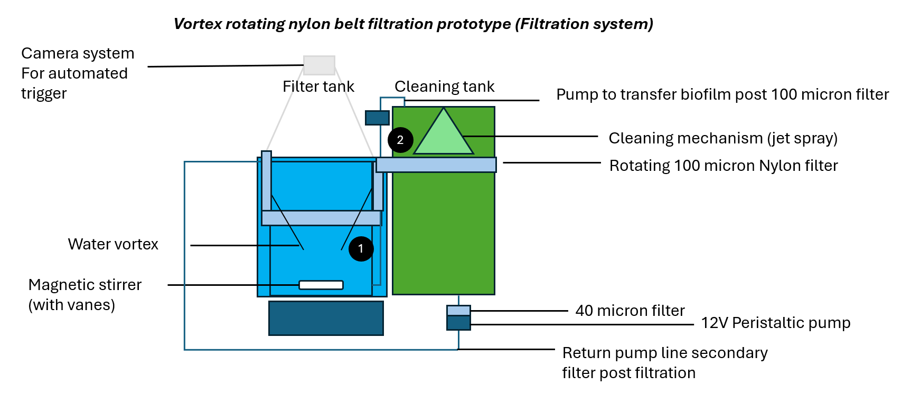
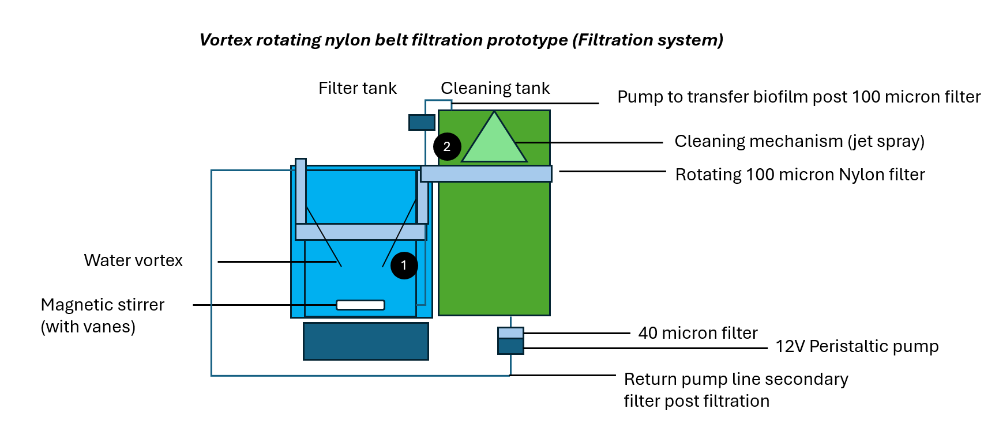
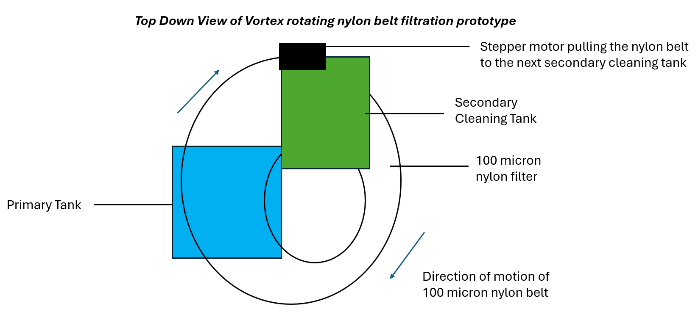
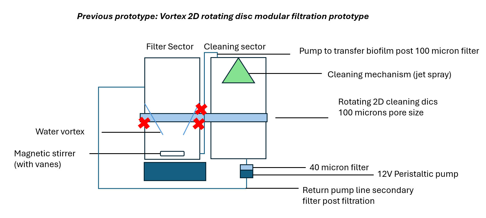
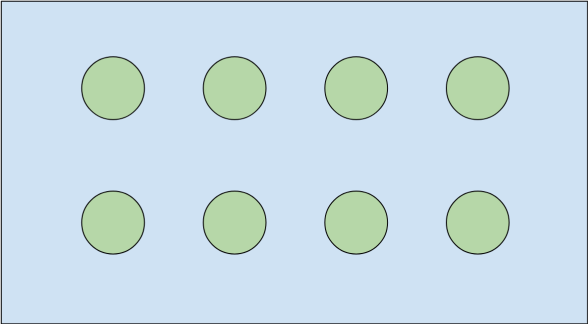

**CDE4301 IS-403**
**Biofilm Removal for Duckweed Cultivation**

# 1. Introduction (Shannen) 
**1.1. The Rise of Microgreens and Smart Indoor Farming in Singapore**

&nbsp;&nbsp;&nbsp;&nbsp;&nbsp;&nbsp;Singapore imports over 90% of its food due to limited land, making it vulnerable to global supply disruptions. (Singapore Food Agency, 2023) To improve resilience, there is a growing push to increase local food production, particularly through high-efficiency and space-saving methods. (Begum, 2020) Microgreens, which are fast-growing and nutrient-dense, have emerged as a promising way to boost local food supply. (Singh et al., 2024) Indoor farming enables year-round cultivation in controlled environments using methods such as vertical farming and hydroponics, but high operational costs and labour constraints limit large-scale adoption. (Loh, 2024) To address these issues, there is increasing demand for Agriculture 4.0 technologies, including automation, sensors and data-driven systems, which can improve efficiency, optimize resource use and enhance crop quality. (Begum, 2025a) The Singapore Green Plan 2030 was recently postponed to 2035, with renewed plans to support indoor farms and revised targets to increase production of both vegetables and protein. (Begum, 2025b) As the need for fresh, locally grown produce rises (Tham, 2024), integrating advanced technologies into these production methods become essential for achieving sustainable and scalable local food production.

  **1.2. Problem Statement**

&nbsp;&nbsp;&nbsp;&nbsp;&nbsp;&nbsp;Duckweed is a fast-growing, nutrient-rich microgreen with potential to contribute to sustainable indoor farming and local food production. (Zięć et al., 2025) However, because it is cultivated in water, it is prone to biofilm adhesion, which reduces growth and harms plant health. (Zhang et al., 2010) This presents a key challenge for duckweed cultivation. Addressing biofilm formation and adhesion is therefore critical to ensure healthy duckweed growth and maintain its potential as a sustainable food source. 

  **1.3. Project Objectives**

&nbsp;&nbsp;&nbsp;&nbsp;&nbsp;&nbsp;This project aims to develop a system to detect and remove biofilm forming on duckweed in controlled environments. It begins by evaluating the problem of biofilm on duckweed and current control methods to assess their effectiveness and identify areas for improvement. Different biofilm removal methods will then be compared to identify an approach that is both novel and effective. Based on these findings, the chosen method will be designed and tested, while considering its impact on duckweed growth. Finally, the project will consider its potential use in intensive duckweed cultivation and provide recommendations for future improvements and applications in food production. 

 

# 2. Duckweed (Shannen) 
&nbsp;&nbsp;&nbsp;&nbsp;&nbsp;&nbsp;Duckweed was selected for this project due to its rapid growth, high nutritional content and suitability as a high-efficiency crop in controlled environments. Its rapid doubling time also makes it a practical choice for experiments, as changes in population can be observed over a short period. This section reviews its key characteristics, including physical traits, protein content, clonal reproduction and growth patterns, factors affecting growth and indicators of poor health, providing essential background for addressing challenges such as biofilm formation. 

  **2.1. Physical Characteristics**

&nbsp;&nbsp;&nbsp;&nbsp;&nbsp;&nbsp;Duckweed is a small, fast-growing aquatic plant that floats on the surface of freshwater and reproduces primarily through asexual budding, producing genetically identical plants that contribute to rapid colony formation. It is one of the smallest plants, typically 1-15 mm in length, with simple, flat, oval-shaped fronds. (Ziegler et al., 2023) The fronds are buoyant due to air-filled tissues, which help keep the plant afloat (Chen, 2024) and  form dense mats on the water surface. (Walsh et al., 2021) Duckweed naturally grows in still or slow-moving freshwater bodies and can tolerate a range of environmental conditions. (Thingujam et al., 2024) 

  **2.2. Nutritional Value**

&nbsp;&nbsp;&nbsp;&nbsp;&nbsp;&nbsp;Duckweed is highly nutritious, containing 20-35g of protein per 100g dry weight. (Appenroth et al., 2017) In comparison, Pak Choi, a locally familiar vegetable, contains about 1.4g of protein per 100g fresh weight, which corresponds to roughly 18g per 100g dry weight. (WebMD, n.d.) Duckweed also doubles its biomass within approximately three days, allowing multiple harvests per week (ScienceDirect, 2016), whereas Pak Choi can typically only be harvested every three weeks. (NParks, 2023) This combination of high protein content and fast growth makes duckweed an attractive option for sustainable indoor food production. Already consumed in countries such as Thailand (Zięć et al., 2025), it demonstrates considerable potential as a future food ingredient. 

  **2.3. Clonal Reproduction and Sigmoidal Growth**

&nbsp;&nbsp;&nbsp;&nbsp;&nbsp;&nbsp;Duckweed’s clonal reproduction is closely linked to the classic logistic (sigmoidal) growth model used in population dynamics. (Faizal et al., 2021) Duckweed primarily reproduces through vegetative budding, where a mother frond produces daughter fronds that remain attached briefly before separating. (Zhang et al., 2020) Each new frond is genetically identical, or a clone, and under stable environmental conditions, each frond has roughly the same probability of producing new fronds per unit time. (Ziegler, 2025)

2.3.1. *Lag Phase*

&nbsp;&nbsp;&nbsp;&nbsp;&nbsp;&nbsp;When a new culture is inoculated, there may be a short acclimation period as fronds adjust to the new environment, repair stress and optimize metabolism. (Singh et al., 2025) Population increase is minimal during this phase, which lasts about a day, but fronds are preparing for rapid reproduction. (Faizal et al., 2021) 

2.3.2. *Exponential (Log Phase)*

&nbsp;&nbsp;&nbsp;&nbsp;&nbsp;&nbsp;Once acclimated, each frond buds at its characteristic rate, producing rapid population expansion. (Yang, 2022) Because reproduction is independent of mating, growth can be very fast, with doubling times as short as 1 to 3 days depending on conditions. (Coughlan et al., 2022) This rapid growth allows duckweed to quickly cover the water surface. 

2.3.3. *Plateau (Stationary) Phase*

&nbsp;&nbsp;&nbsp;&nbsp;&nbsp;&nbsp;Exponential growth cannot continue indefinitely. As the mat thickens and density increases, growth slows due to density-dependent factors such as self-shading and waste accumulation. (Walsh et al., 2021)

  **2.4. Factors Affecting Growth**

&nbsp;&nbsp;&nbsp;&nbsp;&nbsp;&nbsp;Several environmental and physiological factors influence duckweed growth in controlled systems. Light intensity and photoperiod affect photosynthesis and biomass accumulation, while temperature influences metabolic rates and reproduction speed. (Islam et al., 2025) Nutrient availability, particularly nitrogen, phosphorus and micronutrients, directly impact frond production and protein content. (Ruvini Hiththatiyage et al., 2026) Water quality parameters such as pH and the presence of toxins or pollutants can also limit growth. (Jones et al., 2023) Additionally, overcrowding and self-shading in dense mats can slow reproduction, (Walsh et al., 2021) while the accumulation of microbial films on the fronds can further inhibit growth. (Zhang et al., 2010) 

  **2.5. Indicators of Poor Growth**

&nbsp;&nbsp;&nbsp;&nbsp;&nbsp;&nbsp;Poor duckweed growth can be identified through several observable signs. Healthy fronds float on the water surface, but stressed or unhealthy ones may produce turions, which sink, indicating reduced buoyancy or survival strategy under stress. (Ziegler et al., 2023) Discolouration, such as white or yellowed fronds, can signal nutrient deficiencies, disease or environmental stress. (Bunyoo et al., 2022)

 

# 3. Biofilm (Shannen) 
&nbsp;&nbsp;&nbsp;&nbsp;&nbsp;&nbsp;Biofilms originate from microorganisms naturally present in water, including bacteria, fungi, algae and protozoa, which can attach to any suitable surface in a moist environment. (Ali et al., 2023) These microorganisms secrete a self-produced matrix called extracellular polymeric substances (EPS), made of polysaccharides, proteins, DNA and water, which protects the community and enables its expansion. (Zhao et al., 2023) While environmental parameters can be precisely controlled in indoor cultivation systems, biofilm readily establishes and exhibits high resilience, presenting a significant challenge to maintaining healthy duckweed culture. This section examines the growth of biofilm and its negative interactions with duckweed.

  **3.1. Physical Characteristics**

&nbsp;&nbsp;&nbsp;&nbsp;&nbsp;&nbsp;Duckweed is a small, fast-growing aquatic plant that floats on the surface of freshwater and reproduces primarily through asexual budding, producing genetically identical plants that contribute to rapid colony formation. It is one of the smallest plants, typically 1-15 mm in length, with simple, flat, oval-shaped fronds. (Ziegler et al., 2023) The fronds are buoyant due to air-filled tissues, which help keep the plant afloat (Chen, 2024) and  form dense mats on the water surface. (Walsh et al., 2021) Duckweed naturally grows in still or slow-moving freshwater bodies and can tolerate a range of environmental conditions. (Thingujam et al., 2024) 

  **3.2. Stages of Biofilm Development**

&nbsp;&nbsp;&nbsp;&nbsp;&nbsp;&nbsp;Biofilm formation occurs in five main stages. It begins with the attachment stage, where free-floating bacteria loosely adhere to surfaces through weak forces like van der Waals interaction and electrostatic attraction. This is followed by irreversible adhesion as bacteria anchor and initiate production of the EPS. Next, in the microcolony formation stage, the attached bacteria proliferate and aggregate into small clusters. During the maturation stage, the biofilm develops into a complex three-dimensional structure with the microcolonies. Finally, in the dispersion stage, some bacteria detach to colonise new surfaces, allowing biofilms to spread and re-establish elsewhere. (Ugwu et al., 2025) 

  **3.3. Sources and Growth Drivers**

&nbsp;&nbsp;&nbsp;&nbsp;&nbsp;&nbsp;In duckweed cultivation, microorganisms are readily introduced through the water source, nutrient solutions or handling of the plants. (An et al., 2024) Biofilm formation is driven by the presence of available surfaces for attachment, sufficient moisture and nutrients that sustain microbial metabolism. (Ugwu et al., 2025) Environmental conditions common in cultivation, such as stagnant water, warm temperatures and high nutrient conditions, further accelerate biofilm development. (Li et al., 2023) 

  **3.4. Negative Impact of Biofilm Adherence on Duckweed Growth**

*Figure 1. Biofilm In Duckweed Tank*

&nbsp;&nbsp;&nbsp;&nbsp;&nbsp;&nbsp;Although biofilms can be beneficial in some contexts such as stabilising ecosystems, recycling nutrients or supporting beneficial microbial communities (Musa et al., 2024), they are detrimental to duckweed cultivation in controlled systems. On duckweed fronds, biofilms adhere to the plant surface, physically obstructing frond reproduction (Zhang et al., 2010) and hindering nutrient uptake, leading to slower growth and lower biomass. Additionally, biofilms can harbour competing or pathogenic microbes, further compromising plant health (An et al., 2024) and potential for safe consumption. (Zięć et al., 2025) Although a dense duckweed population can partially limit biofilm accumulation (Beitle et al., 2025), this comes at the cost of reduced productivity and continued negative impacts on overall crop performance.

 

# 4. Value Proposition (Shannen) 
&nbsp;&nbsp;&nbsp;&nbsp;&nbsp;&nbsp;To address the problem of biofilm in duckweed cultivation, we identified stakeholders impacted and evaluated current management measures, recognising that existing methods are few, disruptive and labour-intensive. The proposed system aims to explore novel biofilm removal methods.

  **4.1. Stakeholder Analysis**

&nbsp;&nbsp;&nbsp;&nbsp;&nbsp;&nbsp;We were inspired by Dr Yuchen Long’s research on duckweed and visited his lab, where he shared that he encountered significant biofilm contamination while cultivating duckweed. He explained that biofilm can rapidly cover plant surface and system components, competing with duckweed for nutrients, oxygen and light, while also harbouring potentially harmful microorganisms, and is difficult to remove once established. Currently, the lab uses bleaching to control biofilm, which risks damaging the crop, highlighting the need for alternative solutions to support healthy duckweed growth. 

&nbsp;&nbsp;&nbsp;&nbsp;&nbsp;&nbsp;In line with Singapore’s goal of strengthening local food production, the primary stakeholders of the project are indoor farming operations, which require efficient and reliable systems to maintain microgreen cultivation. (EDB Singapore, 2025) These users would benefit from improved biofilm management, resulting in higher productive and reduced reliance on labour-intensive or potentially damaging control methods. Farm technicians and workers are also key stakeholders as they are responsible for operating and maintaining the system. 
	
&nbsp;&nbsp;&nbsp;&nbsp;&nbsp;&nbsp;Secondary stakeholders include researchers and R&D institutions who are interested in advancing duckweed cultivation and biofilm management strategies. In addition, consumers represent a broader stakeholder group, benefiting from safer and more sustainable food production enabled by improved cultivation practices.		

  **4.2. Current Biofilm Management Techniques**

&nbsp;&nbsp;&nbsp;&nbsp;&nbsp;&nbsp;Currently, no commercial or standardised systems provide real-time detection and removal of biofilm from duckweed fronds. While laboratory protocols exist for sterilisation of duckweed and hydroponic technologies can manage general biofilm, there is no integrated solution that combines continuous monitoring with duckweed-specific biofilm control.

4.2.1. *Lab Protocols for Biofilm Removal*

&nbsp;&nbsp;&nbsp;&nbsp;&nbsp;&nbsp;Laboratory protocols have been developed specifically for duckweed, focussing on surface sterilisation and gentle rinsing, where fronds are briefly soaked in dilute sodium hypochlorite (~1% bleach) followed by multiple rinses to remove surface microbes and loose biofilm. (Laurich, 2019) 

4.2.2. *Biofilm Management in Hydroponics Systems*

&nbsp;&nbsp;&nbsp;&nbsp;&nbsp;&nbsp;In broader hydroponic systems, biofilm is managed using physical and mechanical methods, such as scrubbing or flushing surfaces, ultrasonic or sound-based disruption and UV. (Mehmood et al., 2025) Chemical interventions are also commonly applied. (An et al., 2024) 

4.2.3. *Current Biofilm Detection Methods*

&nbsp;&nbsp;&nbsp;&nbsp;&nbsp;&nbsp;Microscopical and imaging methods are among the most commonly used for biofilm detection, enabling direct visualisation of biofilm structure and thickness. In addition, biological approaches such as colony-forming unit assays, are also employed to estimate viable microbial populations by culturing biofilm cells on agar plates. Chemical techniques use staining assays and analysis of EPS or metabolic activity to quantify biofilm presence. (Achinas et al., 2020) Optical and spectroscopic methods further complement these techniques by quantifying biofilm growth through changes in light absorption, reflection or molecular composition. (Kulshrestha & Gupta, 2024) More recently, sensor-based and physical detection methods have emerged, including optical fibre sensors (Rakhimbekova et al., 2022) and capacitive sensors. (Zirk et al., 2022)

  **4.3. Gaps in Existing Approaches and Our Proposed Solution**

4.3.1. *Evaluation of Current Biofilm Management Methods*

&nbsp;&nbsp;&nbsp;&nbsp;&nbsp;&nbsp;Laboratory protocols for duckweed are not suitable for continuous or large-scale cultivation. These methods are labour-intensive and may disrupt normal duckweed growth if applied repeatedly, while also failing to prevent rapid re-establishment of biofilm due to the chemical resistance of the EPS matrix. (Hasan & Aggarwal, 2024) In hydroponic systems, existing mechanical methods could potentially be adapted to remove biofilm from duckweed surfaces without relying on harsh chemicals that pose safety concerns for human consumption. (An et al., 2024)

4.3.2. *Evaluation of Current Biofilm Detection Methods*

&nbsp;&nbsp;&nbsp;&nbsp;&nbsp;&nbsp;Laboratory methods, such as microscopy and imaging, provide detailed visualisation of biofilm structure but are destructive, labour-intensive and unsuitable for continuous monitoring. Similarly, biological approaches can quantify viable microbes but they are slow and do not capture non-culturable cells or the EPS matrix. Chemical techniques can detect and quantify biofilm more directly, yet they require sampling and cannot provide real-time feedback. (Achinas et al., 2020) In contrast, optical and sensor-based approaches show the most promise for monitoring biofilm on duckweed. Optical techniques allow non-invasive and rapid tracking of biofilm growth and composition (Kulshrestha & Gupta, 2024), while emerging sensors can provide real-time and non-destructive detection. (Rakhimbekova et al., 2022) 

4.3.3. *Limitations Addressed*

&nbsp;&nbsp;&nbsp;&nbsp;&nbsp;&nbsp;We propose an integrated, real-time system specifically designed for duckweed cultivation. The approach uses camera-based imaging to continuously monitor biofilm formation on duckweed fronds. Image analysis algorithms quantify biofilm growth and trigger a signal when biofilm exceeds set thresholds. This signal then activates a mechanical removal mechanism to eliminate biofilm from the plant surface. By combining automated detection with targeted mechanical removal, the system provides non-destructive, continuous, real-time biofilm management while reducing labour requirements. 

 

# 5. Methods (Jingten)

&nbsp;&nbsp;&nbsp;&nbsp;&nbsp;&nbsp;To identify potential concept solutions, we established a set of protocols to ensure accurate evaluation. Duckweed cultures were set up in controlled lab environments, with initial biomass was standardised to enable consistent comparison. Growth was monitored using a camera-based imaging system, while duckweed health was assessed manually before and after biofilm removal. Biofilm removal interventions were carried out at the appropriate time and data were analysed by comparing treated and untreated cultures to assess the effectiveness of intervention and duckweed growth. 

  **5.1. Duckweed Culture Setup** 

&nbsp;&nbsp;&nbsp;&nbsp;&nbsp;&nbsp;Duckweed cultures were maintained for 7 days, under controlled laboratory conditions to ensure reproducibility and accurate evaluation of interventions. Cultures were grown in 5cm by 5cm square containers with a 10 cm height. Environmental conditions were maintained at a temperature of 23°C, with a long day light cycle (16 hours light, 8 hours dark). The growth medium had a pH of 7.5 and was prepared according to the composition detailed in Table 1 below. 

|Stock Compound | Concentration (mM) |
| :--- | :--- |
| Monopotassium Phosphate | 0.15 |
| Calcium Nitrate Tetrahydrate | 1.00 |
| Potassium Nitrate   | 8.00 |
| Manganese (II) Chloride Dihydrate  | 0.013 |
| Boric Acid   | 0.005 |
| Sodium Molybdate Dihydrate  | 0.0004 |
| Magnesium Sulfate Heptahydrate  | 1.00 |
| Ethylenediaminetetraacetic Acid   | 0.025 |

Table 1: Composition of Growth Medium

  **5.2. Growth Monitoring** 

&nbsp;&nbsp;&nbsp;&nbsp;&nbsp;&nbsp;Images were captured once per day to monitor duckweed growth, frond surface coverage and biofilm formation. Daily imaging was selected as duckweed has a rapid growth rate, with noticeable changes occurring within short time periods. 

5.2.1. *Initial Biomass Standardisation*

&nbsp;&nbsp;&nbsp;&nbsp;&nbsp;&nbsp;Standardising the initial biomass ensures that all cultures start with a comparable population of fronds, which is critical for accurately evaluating growth and biofilm intervention. Small differences in starting population can lead to large divergences in growth over time, especially during the exponential phase. Starting with consistent biomass allows for reliable comparison of growth rates, frond coverage and responses to biofilm removal across treatments. It also ensures that each culture enters the lag, exponential and plateau phases under comparable conditions, so differences observed in growth or health are due to experimental variables, not initial population size. Without standardisation, variations in initial biomass could mask or exaggerate the effect of intervention strategies, reducing the accuracy and reproducibility of results. 

*Figure 2. Cross-shaped divider used to for standardized duckweed quantity based on surface area*

&nbsp;&nbsp;&nbsp;&nbsp;&nbsp;&nbsp;To standardise initial biomass, we first spread the duckweed fronds evenly across the cultivation tank. For even distribution, we 3D-printed a cross-shaped divider that divides the tank into four quadrants, allowing us to place fronds uniformly in each section. This ensured that all cultures started with comparable population density.

5.2.2. *Camera System for Growth Rate Measurement* 

&nbsp;&nbsp;&nbsp;&nbsp;&nbsp;&nbsp;A smartphone camera was used to capture images of the water surface. The setup was placed under consistent lighting to minimise shadows and reflections that could affect image analysis. A calibration scale was included in each image to ensure accurate measurement of surface area and coverage. Images were stored on the device and later transferred to a computer for processing using a python application.

5.2.3. *Data Collection for Comparison of Growth Rates* 

&nbsp;&nbsp;&nbsp;&nbsp;&nbsp;&nbsp;Day 1 reflects the lag phase (Faizal et al., 2021) while days 2-7 represent the exponential phase. Because growth rates vary across these three phases, only the exponential phase was used to compare the effects of the interventions on growth rate. 

5.2.4. *Duckweed Health Assessment* 

*Figure 3. Duckweed health conditions based on visual cues. From left to right, healthy green duckweed frond, unhealthy discolored duckweed frond, turions formed by stressed duckweed*

&nbsp;&nbsp;&nbsp;&nbsp;&nbsp;&nbsp;Since duckweed typically grows in still water, any mechanical intervention must account for the movement it generates, as excessive agitation could damage fronds or affect buoyancy. Duckweed health was evaluated manually before and after biofilm removal interventions. Observations focused on key indicators such as yellowing or pale fronds and sinking behaviour which reflect stress. These assessments provided qualitative data on plant health and allowed evaluation of any negative impacts caused by biofilm formation or the mechanical removal process. 

  **5.3. Biofilm Intervention Timing** 
	
&nbsp;&nbsp;&nbsp;&nbsp;&nbsp;&nbsp;Biofilm removal was applied on day 3 of cultivation, corresponding to the early exponential growth phase of duckweed and initial stage of biofilm formation. At this stage, fronds are rapidly reproducing and most sensitive to disruptions in light and nutrient uptake. (Ziegler et al., 2023) Biofilm is in the early irreversible adhesion phase, appearing as a thin, slightly cloudy film on the surface of duckweed fronds and has not developed into a dense and resistant structure. (Bravo et al., 2023) The preceding reversible stage was not targeted, as microbial attachment is transient, weakly bound and difficult to detect or remove efficiently in real time. (Li et al., 2021) Targeting the early irreversible stage maximises removal effectiveness while minimising impact on plant growth. The biofilm is still thin and weakly established, allowing it to be removed without the need for harsh chemicals or strong physical forces that could damage the duckweed fronds. 

  **5.4. Data Analysis** 

*Figure 4. Image analysis of duckweed fronds. Right shows image of an observation of duckweed tank, with the percentage coverage in dicated on the top left. Left shows a masked layer on the duckweed fronds area.*

&nbsp;&nbsp;&nbsp;&nbsp;&nbsp;&nbsp;Data from the camera-based growth monitoring were analysed. Surface coverage and growth rate were quantified for each experimental tank and treated cultures were compared to untreated controls based on these measurements. Duckweed health was recorded qualitatively before and after interventions. This approach allowed assessment of the effectiveness of biofilm removal on duckweed growth while providing qualitative insights into plant conditions. 

&nbsp;&nbsp;&nbsp;&nbsp;&nbsp;&nbsp;The surface coverage was quantified by percentage coverage. First, the image was cropped to standardize the total surface area. Duckweed were defined by circular edge and green color, and through edge detection and defining hsv ranges, a mask was applied on the duckweed to quantify the coverage area in each image. As the app recognizes duckweed as green, unhealthy white duckweed was excluded from the area coverage.

 

# 6. Potential Concept Solutions (Jingten)

&nbsp;&nbsp;&nbsp;&nbsp;&nbsp;&nbsp;For preliminary testing of potential concept solutions, we followed the protocol outlined in Section 5. This section presents the intervention methods we selected, the rationale for each and how they were evaluated. Evaluation criteria includes the effectiveness of biofilm removal from the duckweed fronds, improvements in growth rate, impact on duckweed health and the feasibility of implementing the method in larger-scale cultivation systems.

 **6.1. Loofah-based Filtration System** 

6.1.1. *Hypothesis and Rationale*

&nbsp;&nbsp;&nbsp;&nbsp;&nbsp;&nbsp;Loofah is the fibrous, dried fruit of plants in the cucumber family (Cucurbitacaea) (Gong et al., 2024), consisting of a dense three-dimensional network of cellulose-based fibres. Its porous, lightweight and biodegradable structure makes it commonly used as a sponge (Chen et al., 2017) , while also serving as a low-cost support material in engineering and environmental systems. (Lei et al., 2025) 

&nbsp;&nbsp;&nbsp;&nbsp;&nbsp;&nbsp;In biofilm-related applications, loofah has been widely used in wastewater treatment systems due to its ability to support microbial attachment. (Lago et al., 2024) Its highly porous and fibrous structure provides a large surface area that promotes the adhesion and growth of microorganisms, enabling the formation of stable biofilms while maintaining good water flow. (Dang et al., 2020) 

&nbsp;&nbsp;&nbsp;&nbsp;&nbsp;&nbsp;These same properties suggest that loofah can be repurposed for biofilm removal. Its high surface area and rough microstructure provide numerous attachment sites (Sajjad et al., 2022), while its hydrophilicity, cellulose-rich surface enhances microbial adhesions. (Lei et al., 2025) Additionally, its porous structure allows duckweed to pass through with minimal resistance, enabling filtration without significant disruption. 

6.1.2. *Preliminary Experiment* 

&nbsp;&nbsp;&nbsp;&nbsp;&nbsp;&nbsp;Given the complex structure of a loofah, a preliminary experiment was done to identify the optimal cut section used for filtration. 

*Figure 5. Exploration of Optimal Loofah Filter Surface. The loofah was cut along the dotted line to create surface b and c. (a) Transverse section of loofah as filter. (b) Longitudinal section from outer surface of loofah as filter. (c) Longitudinal section from inner surface of loofah as filter.*

&nbsp;&nbsp;&nbsp;&nbsp;&nbsp;&nbsp;The experiment was conducted using a biofilm substitute made from sodium alginate and calcium chloride, which has a similar structure as the algal biofilm found in the duckweed tank during the problem identification phase. (Borchard et al., 2005) By creating a biofilm substitute of different sizes, the biofilm retention ability of the loofah on different surfaces was quantified by the increase in wet mass after filtering water containing the biofilm substitute. 

&nbsp;&nbsp;&nbsp;&nbsp;&nbsp;&nbsp;The results showed significantly higher increase in wet mass in surface c, where the biofilm is trapped deep within the matrix of the loofah sponge when inspected visually. When filtered using surface a and b, the biofilm was only stuck near the surface of the matrix, and the porous structure of the loofah was disrupted by the biofilm. This suggests that a and b had a higher chance of clogging the filter, requiring frequent maintenance and upkeep, and filters at a lower efficiency. Based on the results, the next experiment was conducted using the inner surface of the loofah sponge.

6.1.3. *Experiment* 

&nbsp;&nbsp;&nbsp;&nbsp;&nbsp;&nbsp;We proceed to investigate the effect of loofah on duckweed growth rate. The experiment was set up with a clean control and a biofilm-infected control to be observed without any intervention. For the intervention, the duckweed culture, along with growth medium, was poured through a loofah or a kitchen sponge into a separate tank. A control setup was prepared by pouring an equivalent amount of duckweed culture directly into another tank without passing through the loofah to understand how pouring disrupts the duckweed growth.

6.1.4. *Results* 

&nbsp;&nbsp;&nbsp;&nbsp;&nbsp;&nbsp;We were not able to accurately compare the growth data due to a reduction in initial duckweed density after filtration, as some fronds were retained by the loofah. As a result, it is difficult to determine whether a change in growth rate was due to effective biofilm removal or simply reduced competition from lower biomass. Additionally, some fronds turned white after filtration, indicating stress or potential damage caused by mechanical handling. 
	
6.1.5. *Evaluation*

&nbsp;&nbsp;&nbsp;&nbsp;&nbsp;&nbsp;A key limitation of this method is that duckweed fronds were retained within the loofah during filtration. Although attempts were made to recover trapped fronds using distilled water, complete retrieval was not achieved, resulting in a reduction in biomass. Furthermore, the amount of biofilm removed may also vary between trials, depending on factors such as flow rate, pouring technique and how the loofah is packed, which affects reproducibility. While visual inspection suggested effective removal, some biofilm may remain on fronds. Over time, the loofah could become saturated with biofilm, reducing its effectiveness and requiring replacement. These factors, combined with labour requirements and potential biomass loss, limit the scalability and consistency of the method for larger cultivation systems. 

 **6.2. Surface Agitation**

6.2.1. *Hypothesis and Rationale*

&nbsp;&nbsp;&nbsp;&nbsp;&nbsp;&nbsp;Surface agitation involves physically stirring the duckweed culture to generate localised shear forces on the frond surfaces, disturbing growth of microorganisms. (Zhou et al., 2018) By gently moving the water around the plants, the biofilm in the early irreversible adhesion phase and loosely attached microbial aggregates can be dislodged. This method targets the interface between the frond and surrounding medium, disrupting developing microcolonies before the EPS matrix fully matures. However, the common practice of duckweed farming is to maintain a calm surface since agitation might disrupt duckweed growth.

6.2.2. *Experiment* 

&nbsp;&nbsp;&nbsp;&nbsp;&nbsp;&nbsp;Duckweed cultures were subjected to two conditions: a stirred treatment and an unstirred control. In the stirred treatment, a spatula was gently moved through the medium and frond surfaces. The unstirred control was left undisturbed to allow natural biofilm formation. 

6.2.3. *Results* 

| Day | 2 | 3 | 4 | 5 | 6 |
| :--- | :--- | :--- | :--- | :--- | :--- |
| Control | 4.53 | -3.66 | 9.61 | -10.9 | 13.0 |
| Surface Agitation | -1.98 | 13.1 | 0.35 | 0.97 | 7.80 | 

Table 2. Growth Rates in Control and Surface Agitation Experiments from Day 2-6

&nbsp;&nbsp;&nbsp;&nbsp;&nbsp;&nbsp;The intervention effectively removed some biofilm from the duckweed surface. Additionally, the duckweed showed no signs of discolouration or sinking, indicating minimal impact to its health. As shown in Table 2, the growth rate was the highest on day 3 following the intervention, but this effect was not sustained. After day 3, the growth rate declined significantly, suggesting that residual biofilm on the surface near the duckweed continued to affect its growth. In comparison, the control exhibited duckweed sinking and a negative growth rate, making direct comparison with the intervention unreliable. 

6.2.4. *Evaluation*

&nbsp;&nbsp;&nbsp;&nbsp;&nbsp;&nbsp;Although some biofilm was successfully removed, the intervention alone is insufficient to fully control biofilm growth. Once detached, microbial cells remain in the medium and can reattach to fronds, allowing biofilm to redevelop. This highlights the need for an additional removal or containment mechanism to capture the dislodged biofilm, preventing it from sticking to duckweed again. Without such a system, repeated agitation may provide only temporary relief and biofilm can rapidly re-establish, limiting the effectiveness of the intervention. 

 **6.3. Magnetic Stirrer**

6.3.1. *Hypothesis and Rationale*

&nbsp;&nbsp;&nbsp;&nbsp;&nbsp;&nbsp;A magnetic stirrer generates a shear force without highly disturbing the surface. A controlled vortex induces fluid motion and mixing throughout the liquid, with flow patterns depending on the rotation speed of the stir bar. (Halász et al., 2007) In biofilm systems, this shear can detach loosely adhered microbial cells and disrupt early-stage biofilm, during the irreversible phase. The vortex allows suspended particles and biofilm fragments to be lifted from the fronds without requiring direct mechanical contact, increasing the chance of detachment. (Jang et al., 2017) Because the fluid motion is evenly distributed, it can reach areas that are difficult to access with localised mechanical methods, providing a more uniform intervention. (Borosil Scientific, 2025) Some of the detached biofilm may settle toward the bottom of the tank due to gravity and vortex movement, reducing the amount of biofilm in contact with duckweed surfaces. (Glover & Fitzpatrick, 2007) In contrast, simply stirring the tank without a controlled vortex may only move water locally, causing uneven detachment and less predictable settling of biofilm fragments.

6.3.2. *Experiment* 

&nbsp;&nbsp;&nbsp;&nbsp;&nbsp;&nbsp;Duckweed cultures were subjected to two conditions: a stirred treatment and an unstirred control. In the stirred treatment, a magnetic stirrer generated a continuous vortex throughout the medium, applying shear forces to both the water column and frond surfaces. The unstirred control was left undisturbed to allow natural biofilm formation. 

6.3.3. *Results* 

| Day | 2 | 3 | 4 | 5 | 6 |
| :--- | :--- | :--- | :--- | :--- | :--- |
| Control | 4.53 | -3.66 | 9.61 | -10.9 | 13.0 |
| Magnetic Stirrer | 11.1 | 13.3 | 7.17 | 7.31 | 7.80 |

Table 3. Growth Rates in Control and Magnetic Stirrer Experiments from Day 2-6

&nbsp;&nbsp;&nbsp;&nbsp;&nbsp;&nbsp;The intervention effectively removed most biofilm from the duckweed surface. Additionally, the duckweed showed no signs of discolouration or sinking, indicating minimal impact to its health. As shown in Table 3, the growth rate was the highest on day 3 following the intervention and this effect was sustained. After day 3, growth rates decreased slightly, suggesting that as the biofilm settled below, it had less impact on the duckweed. In comparison, the control exhibited duckweed sinking and a negative growth rate, making direct comparison with the intervention unreliable. 

6.3.4. *Evaluation*

&nbsp;&nbsp;&nbsp;&nbsp;&nbsp;&nbsp;The magnetic stirring intervention worked well, effectively dislodging most biofilm from duckweed surfaces and spinning fragments down toward the bottom of the tank. However, larger biofilm fragments still remained on the surface. This is consistent with the need to remove the biofilm when the EPS is still in its early stages of development. While further work is needed to optimize removal and settlement, it has the potential to be scaled and automated. Since the detached biofilm can settle, a method could be developed to contain and remove it efficiently.

 

# 7. Optimization of Chosen Concept Solution: Magnetic Stirrer (Jingten)

&nbsp;&nbsp;&nbsp;&nbsp;&nbsp;&nbsp;We selected the magnetic stirrer as the preferred intervention because it effectively dislodged biofilm and allowed fragments to settle, resulting in the greatest improvement in growth rate. Compared to the other two methods, it also performed best in terms of biofilm removal, health, and potential for implementation. The focus of optimisation is now on fine-tuning vortex speed to maximise biofilm detachment while minimising stress or damage to the duckweed, ensuring an effective and balanced intervention. 

 **7.1. Experimental Method** 

&nbsp;&nbsp;&nbsp;&nbsp;&nbsp;&nbsp;To optimize the magnetic stirrer, we conducted an experiment for stirring at different speeds for duckweed with biofilm. To ensure a fair comparison, key variables were kept constant across all trials, including tank volume, stir bar size and the position of the stir bar. Biofilm removal was assessed through visual observation of detachment from duckweed fronds. 

 **7.2. Optimisation of Vortex Speed**

&nbsp;&nbsp;&nbsp;&nbsp;&nbsp;&nbsp;While higher vortex speeds generate stronger shear forces that improve the removal of EPS (Hasan & Aggarwal, 2024), they can also negatively affect duckweed by causing physical stress. To evaluate this trade-off, experiments were conducted at two different speeds 600 rpm and 870 rpm, where the higher speed prioritizes biofilm removal and disturbs the surface slightly while the lower speed ensures that the surface disturbance is minimal during the vortex. 

&nbsp;&nbsp;&nbsp;&nbsp;&nbsp;&nbsp; It was observed that biofilm removal improved at 870 rpm. However, the vortex may have been too strong, as some discolouration was observed after the intervention. Further testing within the range of 600 to 870 rpm is needed to ensure that duckweed health is maintained. 

 

# 8. Final Design Specifications (Isaac) 
&nbsp;&nbsp;&nbsp;&nbsp;&nbsp;&nbsp;The final design integrates monitoring and automated biofilm removal from duckweed fronds and medium surface in a cultivation system. Key components include: a camera monitoring system, an automated trigger system and a magnetic stirrer, filtration system and an automated jet cleaning of filter module.The module is also 15cm by 15cm in size, making it a small prototype that is modular. 

*Figure 6 Vortex rotating nylon belt filtration system with camera*

 **8.1. Camera Monitoring System** 
 **8.1.1 Camera** 
- OV5640 5MP Fixed Focus lens
- A camera is mounted on a bracket above the primary tank
- Control: ESP32 S3 WROOM Freenove is used, with a flexible cable connector to connect directly to the OV5640
- Power: 18650 battery with a TP5400 power supply powers the camera for 14 days, for testing. 

 **8.1.2. Image Analysis** 
- Using HSV boundaries to detect algae, which are of darker greens than wolffia, and fourier transform to remove the low frequency spatial features (long, larger objects) compared to the higher frequency smaller duckweed. 

 **8.2. Automated Trigger System** 
- The camera system takes a photo once every 6 hours. When the biofilm growth is too high and /or crosses the threshold where duckweed growth is slowing, the filtration system is activated. 

 **8.3. Filtration Mechanism** 
- Primary filter: 100 micron nylon filter
- Secondary filter: 40 micron cell filter
- Primary filter: ensures a separation between the wolffia and the biofilm that will be pulled past the primary filter. The primary filter pore size is smaller than wolffia (300 micrometers) which ensures this. 
- In the cleaning tank, the peristaltic pumps pull the biofilm through the 40 micron filter, which traps the biofilm in the filter. The solution is returned to the primary tank in a closed system, to ensure a recovery of nutrients. 

 **8.4. Magnetic Stirrer** 
- Creates a vortex that pulls down biofilm past the 100 micron nylon filter
- separates the biofilm downwards from the floating wolffia above the nylon filter 

 **8.5. Cost of Prototype** 

|  | Component | Cost (SGD) |
| :--- | :--- | :--- |
| 1 | OV5640 DVP Fixed Focus  | 9.48 |
| 2 | 2 Peristaltic pumps | 32.62 |
| 3 | 1 Magnetic induction stirrer | 18.86 |
| 4 | 555 Motor 18V Diaphragm High Pressure Pump 8bar Pressure 150ml/min | 16.24 |
| 5 | Double-layer Resin Car Fuel Hoses | 5.17 |
| 6 | PVC Food OD 10xID 8mm, 1M | 2.13 |
| 7 | LM2586 DC DC Step Down Buck Converter | 2.95 |
| 8 | MG90s Stepper Motor | 5.34 |
| 9 | MP1584EN Step Down Voltage Converter | 2.40 |
| 10 | TB6612 Dual Motor Drive Board | 7.64 |
| 11 | 12V 5A AC to DC Power Adaptor | 14.90 |
|  | Total | 117.73 |

Table 4. Cost of Prototype

 **8.6. Prototype filtration mechanismr** 

The vortex from the magnetic stirrer pulls the biofilm at the surface downwards. It separates the biofilm from the wolffia (on the surface undisturbed) while the biofilm travels downwards. It passes through the 100 micron filter and / or gets stuck onto the 100 micron filter, to the bottom of the primary tank. Once the biofilm has crossed the filter and is pulled down into the lower half of the primary tank, the peristaltic peristaltic pump moves the biofilm to the cleaning tank. For the biofilm that gets stuck on the 100 micron nylon filter, it is also moved into the cleaning tank via a stepper motor that pulls the 100 micron nylon filter belt. 

In the cleaning tank, a jet spray sprays the 100 micron filter vigorously and the biofilm is removed out from the 100 micron nylon filter. The biofilm in the secondary tank is then filtered through a 40 micron filter using a peristaltic pump. This catches the biofilm and the resulting solution is delivered back to the primary tank to recycle the nutrients in a closed system. 

*Figure 7 Vortex rotating nylon belt filtration system*

*Figure 8 Vortex rotating nylon belt filtration system Top Down View*

Initially a 2D rotating disc was considered, however, it had significant downsides compared to the flexible 100 micron nylon filter. Though seemingly straightforward, where the filter once clogged by the vortex can be rotated out to the cleaning tank, a rotating disc would require additional actuators and seal at the interface of the primary tank to prevent water egress outside of the primary tank. (seen in the red crosses below)

*Figure 9 Previous prototype: Vortex 2D rotating disc modular filtration prototyle, red x mark potential water egress*

 **Rotating Drum Filters** 

Rotating Drum Filters where a large mesh drum rotates and water flows into the drum outwards of the drum. This will trap the wolffia against the drum as the spray bar jets at the wolffia and biofilm. Eventually it will be sprayed into the waste bin. (Aqua Exclusive, 2025)

In comparison, our system uses a ‘false bottom’ conveyor belt, where the mesh is horizontal and submerged and plants float above the moving belt. Rotating Drum Filters would excel in removing fish feces and uneaten food but are not ideal for selective cleaning of wolffia.

 **Surface Skimmers** 

Surface skimmers are also normally used to remove biofilm in aquaponics and ponds. Where a hinged flap or gate is situated a few millimeters below the water level. Water spills over the weir into a mechanical filter e.g. a mesh bag. (SkimOil, 2026) However, this would not work for duckweed agriculture as the surface skimmer is unable to separate the also floating duckweed from the biofilm. Additionally, when the water is pulled into the mesh bag, the duckweed will no longer be floating in the growth area (the surface of the medium), having been removed from its original growing area, and is mixed with the biofilm. 

 **Travelling Band Screens** 

Travelling Band Screens are another industrial high capacity secondary filtration system to remove debris from raw water before it reaches other downstream equipment. In agriculture, they are used for algae management (International Water Screens, 2015). These are also self-cleaning, which is an essential feature that our filtration system is also designed to have. However, they will not be suited to separate wolffia from biofilm as it only lifts what is on the screen, which will be both wolffia and biofilm. An additional separating mechanism (e.g. a vortex) is required to pull the biofilm through given a large enough mesh size, however, yet smaller than the wolffia’s diameter. These findings were subsequently integrated in our design. 

 **Chemical methods** 

Immersion into diluted sodium hypochlorite (bleach) or hydrogen peroxide is done in the lab, however, in agriculture, as a routine maintenance procedure, it might result in increased plant stress and requires high precision as if submerged for longer than specified duration will lead to total plant death (Kettongruang et al., 2026), as well as low sustainability requiring external chemicals. Especially in larger scale ponds, the amount of bleach increases compared to a smaller controlled lab setting. 

 **Ultrasonic Cleaning** 

Ultrasonic cleaning uses acoustic cavitation and is used for cleaning in medicine (Khan et al., 2023), jewelry (Juangjai et al., 2025) and small crevices. It can also be used for cleaning agricultural machinery or post harvest food processing of fruits and vegetables. (Hong et al., 2022). However, for duckweed wolffia, when ultrasonic waves are applied it will cause cell disruption (Mirón-Mérida et al., 2024) and is unusuitable for wolffia. 

Our design attempts to leverage on the design for self cleaning of the filter (in a rotating drum filter), by using a flexible nylon filter that can be physically moved to a separate chamber for cleaning, without stressing the wolffia duckweed physically by tumbling, hence not using a 3D drum design. This allows for self cleaning which is also more advantageous compared to a static mesh bag filter. Such a novel design had to be developed as wolffia is delicate and would be crushed under traditional industrial methods, leaving the wolffia untouched on the surface, and to separate wolffia from biofilm during the wolffia’s growth stage, as continuous culture management, is uncommon.  From our preliminary search, this design is our unique competitive advantage in duckweed biofilm filtration systems. 

# 9. Detail Design (Isaac) 

 **9.1. Design Requirements** 

&nbsp;&nbsp;&nbsp;&nbsp;&nbsp;&nbsp;Our target users are indoor farms in Singapore, which operate under tight margins and limited technical staff. (Loh, 2024) The system is designed to provide a cost-effective, automated and scalable solution for controlling biofilm in duckweed cultivation while maintaining plant health.

| Practical Considerations |  | 
| :--- | :--- |
| Affordability  | Systems should be low-cost to encourage adoption.  |
| Ease of Use  | Plug-and-play setup with minimal technical knowledge required. |
| Waste Management  | Detached biofilm will be collected and neutralised before being safely disposed of.   |
| Space Efficiency  | Compact design fits standard indoor farm tanks without interfering with lighting or circulation. |
| Energy Efficiency  | The system consumes minimal energy as the stirrer and filtration mechanism operates intermittently, triggered automatically only when biofilm is detected. |
| Maintenance and Hygiene   | Components should be easy to clean, resistant to microbial growth and require minimal labour.  |
| Regulatory Compliance  | All parts in contact with duckweed or growth medium must be food-safe and comply with Singapore Food Agency (SFA) standards. |
| Placement and Stability  | Stirrer and magnetic bar must remain stable, avoiding dislodgement that could damage duckweed or tanks.  |
| Scalability  | The modular design allows multiple tanks to be controlled independently or through a centralised interface. For larger farms, a single control unit can monitor multiple cameras and stirrers, reducing hardware duplication and operational costs.  |

Table 5. Practical Considerations

| Technical Considerations |  | 
| :--- | :--- |
| Automated Intervention  | High-resolution, waterproof cameras continuously monitor the water surface and duckweed. A lightweight computer vision algorithm detects early-stage biofilm and automatically triggers the stirrer when thresholds are reached. |
| Control Unit and Feedback  | The microcontroller and or single-board computer integrates camera input, stirrer control and user interface. Operation time, vortex intensity and biofilm levels are logged and users are notified of abnormal growth or required maintenance. |
| Effective Biofilm Removal  | Controlled vortex lifts biofilm without physically scraping or damaging fronds while spinning the detached biofilm down for removal.  |
| Timing Control  | Intervention occurs during the early irreversible adhesion stage for maximum effectiveness. |
| Adjustable Operation  | Vortex speed and duration can be tuned according to tank size and water depth. |
| Minimal Disruption to Duckweed Growth  | The method minimises frond damage, discolouration and sinking.  |
| Durability and Reliability   | Components withstand repeated use, water exposure and cleaning without degradation.  |
| Multi-Tank Monitoring  | The system supports centralised control, allowing farm staff to monitor multiple tanks from a single dashboard. Alerts for biofilm growth or maintenance are aggregated to simplify management. 

Table 6. Technical Considerations

 **9.2. Implementation** 
&nbsp;&nbsp;&nbsp;&nbsp;&nbsp;&nbsp;Based on the design requirements outlined above, this section illustrates how the system can be implemented in indoor aquaponics agriculture environment. The prototype would be modular and could be distributed on the water surface with a flotation device. It will pull the surrounding water into the filtration mechanism, cleaning the local surface in a distributed manner. 

 **9.2.1. System Layout** 

*Figure 10 Layout of possible arrangement of floating modular prototypes in a duckweed agriculture pond with distributed localised filtration*

# 10. Recommendations for Future Work (Isaac) 

&nbsp;&nbsp;&nbsp;&nbsp;&nbsp;&nbsp;Future development will focus on enhancing the efficiency and sustainability of indoor farming systems through the expansion of the system’s capabilities. While the current design provides automated biofilm control, it also establishes a foundation for more intelligent cultivation systems. Its modular and adaptable architecture enables future integration of advanced monitoring and automation technologies, which could reduce labour requirements and support scalable indoor farming operations. These improvements are also expected to enhance crop performance by enabling early issue detection and optimised growing conditions, resulting in higher yield, improved quality and greater consistency. 

 **10.1. Expanding Camera Monitoring Applications** 

&nbsp;&nbsp;&nbsp;&nbsp;&nbsp;&nbsp;A key area for future development is the expansion of the current camera and image processing system beyond its primary role in biofilm detection. At present, the system is limited to a single-purpose function. However, future enhancements could transform it into a comprehensive monitoring tool for indoor farming applications. 

&nbsp;&nbsp;&nbsp;&nbsp;&nbsp;&nbsp;Indoor farming systems often rely heavily on manual observation to assess plant health and determine harvest readiness, which is both labour-intensive and susceptible to human error. Future work could address this limitation by integrating advanced computer vision techniques to enable continuous, real-time monitoring of plant growth and environmental conditions. (Ghazal et al., 2024) 

&nbsp;&nbsp;&nbsp;&nbsp;&nbsp;&nbsp;For instance, the system could be developed to detect early signs of mold, nutrient deficiencies and overgrowth in microgreens and leafy vegetables. It could also be extended to track duckweed biomass for yield optimisation, as well as identify pests or unwanted algae before infestations become severe. In addition, future implementations may include monitoring water quality through visual surface analysis, analysing plant density to prevent overcrowding and determining optimal harvest timing based on colour and coverage indicators. 

&nbsp;&nbsp;&nbsp;&nbsp;&nbsp;&nbsp;By enabling early detection of potential issues and supporting data-driven decision-making, these enhancements could significantly improve crop yield and quality while reducing reliance on manual labour. Ultimately, this would increase the scalability and efficiency of indoor farming systems. 

 **10.2. Magnetic Stirrer Functional Expansion** 

&nbsp;&nbsp;&nbsp;&nbsp;&nbsp;&nbsp;Another important direction for future work involves enhancing the functionality of the magnetic stirrer system. Currently, its primary role is focused on biofilm removal. However, future improvements could enable adjustable stirring speed and timing to support a wider range of applications. 

&nbsp;&nbsp;&nbsp;&nbsp;&nbsp;&nbsp;By incorporating controllable stirring parameters, the system could be used to optimize nutrient distribution within the water, preventing concentration gradients and promoting uniform plant growth. (Borosil Scientific, 2025) Future developments may also allow for the reduction of stagnant zones, which are often associated with the accumulation of algae and harmful microorganisms. Furthermore, adaptive control strategies could be introduced to match the sensitivity of different crops. Controlled vortex formation could also be explored as a method to enhance oxygenation through increased surface agitation. (V. van de Griend et al., 2022) 

&nbsp;&nbsp;&nbsp;&nbsp;&nbsp;&nbsp;These improvements would transform the magnetic stirrer from a single-function component into a multi-functional system for water quality management and environmental optimisation, thereby increasing its overall effectiveness in indoor farming operations. 

 **10.3. Improvements to treatment and recycling of biofilm for nutrients** 

&nbsp;&nbsp;&nbsp;&nbsp;&nbsp;&nbsp;Biofilm is currently caught in a 40 micron filter and the output water is recycled back into the primary tank. Further development into treating the biofilm to break down the bacteria and recover the nutrients, via mineralization with aerobic bacteria, can be explored and integrated.  (Szekely & Jijakli, 2022) A waste collection system could be set up between the modular filters to facilitate recovery of the biofilm for nutrients. 

 **10.4. Future Research Directions** 

&nbsp;&nbsp;&nbsp;&nbsp;&nbsp;&nbsp;Beyond system-level improvements, several broader research directions could further advance the development of automated indoor farming technologies. Future research will focus on advancing automated indoor farming through AI-driven predictive monitoring, enabling early detection of biofilm formation, nutrient imbalances and plant stress. (Aijaz et al., 2025) The integration of multi-parameter sensing, combining camera data with inputs such as pH and dissolved oxygen, could support real-time system optimisation. (Hemal et al., 2024)

&nbsp;&nbsp;&nbsp;&nbsp;&nbsp;&nbsp;Sustainability will also be a key focus, with efforts to optimise energy and resource use. (Kumari et al., 2025) Additionally, IoT-enabled remote monitoring and predictive maintenance could enhance system reliability (Verdouw et al., 2021), while standardisation may support the development of modular, scalable solutions for wider adoption. (Mallinger et al., 2024) 

 

# 11. Conclusion (Isaac) 
&nbsp;&nbsp;&nbsp;&nbsp;&nbsp;&nbsp;This project addresses the challenge of biofilm formation in duckweed cultivation, which limits plant health and productivity in indoor farming systems. In the context of Singapore’s push for greater food security and local production, improving the reliability and efficiency of high-yield crops like duckweed is increasingly important. The proposed solution integrates real-time camera monitoring with a novel, automated, non-destructive biofilm removal mechanism, enabling early detection and targeted intervention without relying on labour-intensive or chemical-based methods. By enhancing growth conditions and reducing maintenance demands, leveraging on its modular design, the system offers a practical and scalable approach for indoor farms. This work serves as a proof of concept, demonstrating the feasibility of the system under controlled laboratory conditions. However, further validation in real indoor farming environments is required to assess its scalability, robustness and long-term performance. 

 

# References

Achinas, S., Yska, S. K., Charalampogiannis, N., Krooneman, J., & Euverink, G. J. W. (2020). A Technological Understanding of Biofilm Detection Techniques: A Review. Materials, 13(14), 3147. https://doi.org/10.3390/ma13143147 

Aijaz, N., Lan, H., Raza, T., Yaqub, M., Iqbal, R., & Pathan, M. S. (2025). Artificial Intelligence in Agriculture: Advancing Crop Productivity and Sustainability. Journal of Agriculture and Food Research, 20, 101762. https://doi.org/10.1016/j.jafr.2025.101762 

Ali, A., Zahra, A., Kamthan, M., Husain, F. M., Albalawi, T., Zubair, M., Alatawy, R., Abid, M., & Noorani, M. S. (2023). Microbial Biofilms: Applications, Clinical Consequences, and Alternative Therapies. Microorganisms, 11(8), 1934. https://doi.org/10.3390/microorganisms11081934 

An, C., Ye Htut Zwe, Mei, M., Shang, G., Ling, Y., Poh, B. L., Zhou, W., & Li, D. (2024). Sanitization of hydroponic farming facilities in Singapore: what, why, and how. Applied and Environmental Microbiology. https://doi.org/10.1128/aem.00672-24 

Appenroth, Klaus-J., Sree, K. S., Böhm, V., Hammann, S., Vetter, W., Leiterer, M., & Jahreis, G. (2017). Nutritional value of duckweeds (Lemnaceae) as human food. Food Chemistry, 217, 266–273. https://doi.org/10.1016/j.foodchem.2016.08.116 

Aqua Exclusive. (2025, March 12). Rotary Drum Filter RDF. Aqua Exclusive. https://www.aqua-exclusive.com/rotary-drum-filter-rdf/ 

Bachlechner, C., Zand, E., Eisenrauch, V., Mauermann, M., Jäger, H., & Schottroff, F. (2026). Biofilm Properties and Their Implications for Cleaning Processes in the Food Industry - A Review. Journal of Food Protection, 89(2), 100695. https://doi.org/10.1016/j.jfp.2025.100695 

Bamford, N. C., MacPhee, C. E., & Stanley‐Wall, N. R. (2023). Microbial Primer: An introduction to biofilms – what they are, why they form and their impact on built and natural environments. Microbiology, 169(8). https://doi.org/10.1099/mic.0.001338 

Begum, S. (2020, September 9). Nine high-tech farms in Singapore awarded nearly $40 million to ramp up food production. The Straits Times. https://www.straitstimes.com/singapore/nine-high-tech-farms-in-singapore-awarded-nearly-40-million-to-ramp-up-food-production 

Begum, S. (2025a, June 5). Plan in place to help local farms produce more, stay financially viable: SFA chief. The Straits Times. https://www.straitstimes.com/singapore/environment/plan-in-place-to-help-local-farms-produce-more-stay-financially-viable-sfa-chief 

Begum, S. (2025b, November 4). Singapore drops “30 by 30” farming goal, sets revised targets for fibre and protein by 2035. The Straits Times. https://www.straitstimes.com/singapore/environment/singapores-30-by-30-farming-goal-pushed-back-to-2035-with-revised-targets-for-fibre-and-protein

Beitle, E., Justiniano, Y.-A. V., & Morgan, Z. (2025, May 14). Duckweed: A Helpful Plant for Biofilm Reduction. Nasa.gov. https://ntrs.nasa.gov/citations/20250003571 
Borchard, W., Kenning, A., Kapp, A., & Mayer, C. (2005). Phase diagram of the system sodium alginate/water: A model for biofilms. International Journal of Biological Macromolecules, 35(5), 247–256. https://doi.org/10.1016/j.ijbiomac.2005.02.006

Borosil Scientific. (2025, April 15). Magnetic Stirrer: Working Principle, Types & Uses in Labs. Borosil Scientific. https://www.borosilscientific.com/magnetic-stirrer-operating-principle-and-applications/

Bravo, P., Lung Ng, S., MacGillivray, K. A., Hammer, B. K., & Yunker, P. J. (2023). Vertical growth dynamics of biofilms. Proceedings of the National Academy of Sciences, 120(11). https://doi.org/10.1073/pnas.2214211120

Bunyoo, C., Roongsattham, P., Khumwan, S., Phonmakham, J., Wonnapinij, P., & Thamchaipenet, A. (2022). Dynamic Alteration of Microbial Communities of Duckweeds from Nature to Nutrient-Deficient Condition. Plants, 11(21), 2915. https://doi.org/10.3390/plants11212915

Chen, J. (2024). Mind the gap: Spatiotemporal patterns of airspace formation in duckweeds are regulated by hormones. Plant Physiology, 195(4), 2480–2481. https://doi.org/10.1093/plphys/kiae222

Chen, Y., Su, N., Zhang, K., Zhu, S., Zhao, L., Fang, F., Ren, L., & Guo, Y. (2017). In-Depth Analysis of the Structure and Properties of Two Varieties of Natural Luffa Sponge Fibers. Materials, 10(5), 479. https://doi.org/10.3390/ma10050479

Coughlan, N. E., Walsh, É., Bolger, P., Burnell, G., O’Leary, N., O’Mahoney, M., Paolacci, S., Wall, D., & Jansen, M. A. K. (2022). Duckweed bioreactors: Challenges and opportunities for large-scale indoor cultivation of Lemnaceae. Journal of Cleaner Production, 336, 130285. https://doi.org/10.1016/j.jclepro.2021.130285

Dang, H. T. T., Dinh, C. V., Nguyen, K. M., Tran, N. T. H., Pham, T. T., & Narbaitz, R. M. (2020). Loofah Sponges as Bio-Carriers in a Pilot-Scale Integrated Fixed-Film Activated Sludge System for Municipal Wastewater Treatment. Sustainability, 12(11), 4758. https://doi.org/10.3390/su12114758

EDB Singapore. (2025). Edb.gov.sg. https://www.edb.gov.sg/en/about-edb/media-releases-publications/dutch-indoor-farming-company-rowy-opens-new-vertical-farm-in-singapore.html

Faizal, A., Sembada, A. A., & Priharto, N. (2021). Production of bioethanol from four species of duckweeds (Landoltia punctata, Lemna aequinoctialis, Spirodela polyrrhiza, and Wolffia arrhiza) through optimization of saccharification process and fermentation with Saccharomyces cerevisiae. Saudi Journal of Biological Sciences, 28(1), 294–301. https://doi.org/10.1016/j.sjbs.2020.10.002

Ghazal, S., Munir, A., & Qureshi, W. S. (2024). Computer vision in smart agriculture and precision farming: Techniques and applications. Artificial Intelligence in Agriculture, 13. https://doi.org/10.1016/j.aiia.2024.06.004

Glover, G. M. C., & Fitzpatrick, J. J. (2007). Modelling vortex formation in an unbaffled stirred tank reactors. Chemical Engineering Journal, 127(1-3), 11–22. https://doi.org/10.1016/j.cej.2006.09.019

Gong, Y., Luo, X., Zhang, T., Zhou, G., Li, J., Zhang, B., Li, P., & Huang, H. (2024). Assembly and comparative analysis of the complete mitochondrial genome of white towel gourd (Luffa cylindrica). Genomics, 116(3), 110859–110859. https://doi.org/10.1016/j.ygeno.2024.110859

Halász, G., Gyüre, B., Jánosi, I. M., Szabó, K. G., & Tél, T. (2007). Vortex flow generated by a magnetic stirrer. American Journal of Physics, 75(12), 1092–1098. https://doi.org/10.1119/1.2772287

Hasan, M. I., & Aggarwal, S. (2024). Matrix matters: How extracellular substances shape biofilm structure and mechanical properties. Colloids and Surfaces. B, Biointerfaces, 246, 114341. https://doi.org/10.1016/j.colsurfb.2024.114341

Hemal, Rahman, A., None Nurjahan, Islam, F., Ahmed, S., M. Shamim Kaiser, & Muhammad Raisuddin Ahmed. (2024). An Integrated Smart Pond Water Quality Monitoring and Fish Farming Recommendation Aquabot System. Sensors, 24(11), 3682–3682. https://doi.org/10.3390/s24113682

Hong, C., Zhou, H.-C., Zhao, Y.-M., & Ma, H. (2022). Ultrasonic washing as an abiotic elicitor to induce the accumulation of phenolics of fresh-cut red cabbages: Effects on storage quality and microbial safety. Frontiers in Nutrition, 9, Article 1006440. https://doi.org/10.3389/fnut.2022.1006440

International Water Screens. (2015). Agriculture. https://www.internationalwaterscreens.com/industries/agriculture/4

Islam, M. F., Yang, J., Zhao, X., Kazmi, A., Li, X., Hu, H., Sun, Z., Chen, Y., P.P.M. Heenatigala, & Hou, H. (2025). Elevated light intensity and temperature enhance biomass, protein, and starch accumulation in duckweed. Industrial Crops and Products, 237, 122118–122118. https://doi.org/10.1016/j.indcrop.2025.122118

Jang, H., Rusconi, R., & Stocker, R. (2017). Biofilm disruption by an air bubble reveals heterogeneous age-dependent detachment patterns dictated by initial extracellular matrix distribution. Npj Biofilms and Microbiomes, 3(1). https://doi.org/10.1038/s41522-017-0014-5

Jones, G., Scullion, J., Dalesman, S., Robson, P., & Gwynn-Jones, D. (2023). Lowering pH enables duckweed (Lemna minor L.) growth on toxic concentrations of high-nutrient agricultural wastewater. Journal of Cleaner Production, 395, 136392. https://doi.org/10.1016/j.jclepro.2023.136392

Juangjai, N., Chaiaiad, C., & Thongsri, J. (2025). Effect of Detergent, Temperature, and Solution Flow Rate on Ultrasonic Cleaning: A Case Study in the Jewelry Manufacturing Process. Clean Technologies, 7(4), 83. https://doi.org/10.3390/cleantechnol7040083

Khan, M. U., Rehman, F., Saleem, M., Elahi, H., Sung, T. H., & Jabbar, H. (2023). Optimum driving of ultrasonic cleaner using impedance and FFT analysis with validation of image processing of perforated foils. Applied Sciences, 13(12), Article 6991. https://doi.org/10.3390/app13126991

Kettongruang, S., Morikawa, M., & Boonmak, C. (2026). Diversity and Plant Growth-Promoting Potential of Duckweed-Associated Bacteria on Wolffia globosa Biomass Production and Nutritional Quality. Environmental microbiology reports, 18(2), e70312. https://doi.org/10.1111/1758-2229.70312

Kulshrestha, A., & Gupta, P. (2024). Real-time biofilm detection techniques: advances and applications. Future Microbiology, 19(11), 1003–1016. https://doi.org/10.1080/17460913.2024.2350285

Kumari, K., Nafchi, A. M., Mirzaee, S., & Abdalla, A. (2025). AI-Driven Future Farming: Achieving Climate-Smart and Sustainable Agriculture. AgriEngineering, 7(3), 89. https://doi.org/10.3390/agriengineering7030089

Lago, A., Rocha, V., Barros, O., Silva, B., & Tavares, T. (2024). Bacterial biofilm attachment to sustainable carriers as a clean-up strategy for wastewater treatment: A review. Journal of Water Process Engineering, 63, 105368–105368. https://doi.org/10.1016/j.jwpe.2024.105368

Laurich, J. (2019, November 18). Lemna minor (duckweed) sterilization protocol v2. https://doi.org/10.17504/protocols.io.9gdh3s6

Lei, Y., Yang, W., Yuan, Y., Wei, G., & Guo, L. (2025). Functionalization of loofah sponge as a natural cellulose-based material for water environment remediation and sustainability assessment. Carbohydrate Polymers, 358, 123514. https://doi.org/10.1016/j.carbpol.2025.123514

Li, Y., Li, X., Hao, Y., Liu, Y., Dong, Z., & Li, K. (2021). Biological and Physiochemical Methods of Biofilm Adhesion Resistance Control of Medical-Context Surface. International Journal of Biological Sciences, 17(7), 1769–1781. https://doi.org/10.7150/ijbs.59025

Li, Y., Qu, Y., Yang, H., Zhou, X., Xiao, P., & Shao, T. L. (2023). Combatting biofilms in potable water systems: A comprehensive overview to ensuring industrial water safety. Environmental Microbiology Reports, 15(6). https://doi.org/10.1111/1758-2229.13207

Loh, R. (2024, October 19). With several farms closing or struggling to break even, what is the future for agriculture in Singapore? CNA. https://www.channelnewsasia.com/today/big-read/high-tech-low-returns-farming-4684566

Mallinger, K., Corpaci, L., Neubauer, T., Tikász, I. E., Goldenits, G., & Banhazi, T. (2024). Breaking the barriers of technology adoption: Explainable AI for requirement analysis and technology design in smart farming. Smart Agricultural Technology, 9, 100658. https://doi.org/10.1016/j.atech.2024.100658

Mehmood, Ch. T., Waheed, H., & Habimana, O. (2025). Occurrence, challenges, and control strategies for biofilms in irrigation networks of modern agriculture. Journal of Agriculture and Food Research, 25, 102616. https://doi.org/10.1016/j.jafr.2025.102616

Mirón-Mérida, V. A., Soria-Hernández, C., Richards-Chávez, A., Ochoa-García, J. C., Rodríguez-López, J. L., & Chuck-Hernández, C. (2024). The Effect of Ultrasound on the Extraction and Functionality of Proteins from Duckweed (Lemna minor). Molecules, 29(5), 1122. https://doi.org/10.3390/molecules29051122

Musa, O. I., Akande, S. A., Ijah, U. J. J., Abioye, O. P., Maude, A. M., Samuel, J. O., Mustapha, A., Abdulrahim, A.-M., & Gusdanis, A. C. G. (2024). Biofilms communities in the soil: characteristic and interactions using mathematical model. Research in Microbiology, 175(3), 104149. https://doi.org/10.1016/j.resmic.2023.104149

NParks. (2023). Xiao Bai Cai. Nparks.gov.sg. https://gardeningsg.nparks.gov.sg/page-index/edible-plants/xiao-bai-cai/

Rakhimbekova, A., Baizak Kudaibergenov, Damir Moldabay, Zharylgap, A., Ajunwa, O. M., Marsili, E., & Tosi, D. (2022). Biofilm Detection by a Fiber-Tip Ball Resonator Optical Fiber Sensor. Biosensors, 12(7), 481–481. https://doi.org/10.3390/bios12070481

Rather, M. A., Gupta, K., & Mandal, M. (2021). Microbial biofilm: formation, architecture, antibiotic resistance, and control strategies. Brazilian Journal of Microbiology: [Publication of the Brazilian Society for Microbiology], 52(4), 1701–1718. https://doi.org/10.1007/s42770-021-00624-x

Ruvini Hiththatiyage, Prabhath Ariyasena, Fernando, D., Lumini Abeywickrama, Nuhansa Sasindi, Siril Wijesundara, Barana Jayawardana, Madhujith, T., Ruvini Liyanage, Jin, L., & Zhou, X. (2026). Duckweed as a sustainable protein source: Effects of fertilizer regimes on growth, protein yield, and functional properties. Advanced Agrochem. https://doi.org/10.1016/j.aac.2026.02.007

Sajjad, Mohd, Alalwan, H. A., Lee, W. H., & Dai, F. (2022). Experimental investigation of biofilm carriers of varying shapes, sizes, and materials for wastewater treatment in fixed bed biofilm reactor: a qualitative study of biocarrier performance. Journal of Chemical Technology & Biotechnology, 97(9), 2592–2606. https://doi.org/10.1002/jctb.7131

ScienceDirect. (2016). Duckweed - an overview | ScienceDirect Topics. Sciencedirect.com. https://www.sciencedirect.com/topics/earth-and-planetary-sciences/duckweed

Singapore Food Agency. (2023, December 14). MEDIA FACTSHEET - SINGAPORE CONTINUES TO STRENGTHENITS FOOD SUPPLY RESILIENCE. Default. https://www.sfa.gov.sg/news-publications/newsroom/media-factsheet---singapore-continues-to-strengthenits-food-supply-resilience

Singh, A., Singh, J., Kaur, S., Mahendra Gunjal, Kaur, J., Nanda, V., Ullah, R., Sezai Ercisli, & Prasad Rasane. (2024). Emergence of microgreens as a valuable food, current understanding of their market and consumer perception: A review. Food Chemistry X, 23, 101527–101527. https://doi.org/10.1016/j.fochx.2024.101527

Singh, N., Chetty, M., & Rathilal, S. (2025). Optimizing Hydrodynamics for Enhanced CoCultivation in Bubble Column Reactors. 42nd JOHANNESBURG International Conference on “Chemical, Biological and Environmental Engineering” (JCBEE-25). https://doi.org/10.17758/iicbe7.c1125107

SkimOil. (2026, February 19). https://www.skimoil.com/floating-weir-oil-skimmer/ 

Szekely, I., & Jijakli, M. H. (2022). Bioponics as a promising approach to sustainable agriculture: A review of the main methods for producing organic nutrient solution for hydroponics. Water, 14(23), Article 3975. https://doi.org/10.3390/w14233975

Tallawi, M., Opitz, M., & Lieleg, O. (2017). Modulation of the mechanical properties of bacterial biofilms in response to environmental challenges. Biomaterials Science, 5(5), 887–900. https://doi.org/10.1039/c6bm00832a

Tham, D. (2024, June 29). IN FOCUS: Will Singapore meet its 30 by 30 food sustainability goal? CNA. https://www.channelnewsasia.com/singapore/vegetables-seafood-singapore-food-price-cost-farmers-security-4442626

Thingujam, D., Pajerowska-Mukhtar, K. M., & Mukhtar, M. S. (2024). Duckweed: Beyond an Efficient Plant Model System. Biomolecules, 14(6), 628. https://doi.org/10.3390/biom14060628

Ugwu, C. N., Ezeibe, E. N., Emencheta, S. C., Nwagwu, C. S., Ogbonna, K. O., Ejiofor, C. V., Onugwu, A. L., Berebon, D. P., & Attama, A. A. (2025). Biofilms: structure, resistance mechanism, emerging control strategies, and applications. RSC Pharmaceutics. https://doi.org/10.1039/d5pm00094g

V. van de Griend, M., Warrener, F., van, Song, Y., Fuchs, E. C., Willibald Loiskandl, & Agostinho, F. (2022). Vortex Impeller-Based Aeration of Groundwater. Water, 14(5), 795–795. https://doi.org/10.3390/w14050795

Verdouw, C., Tekinerdogan, B., Beulens, A., & Wolfert, S. (2021). Digital twins in smart farming. Agricultural Systems, 189, 103046. https://doi.org/10.1016/j.agsy.2020.103046

Walsh, É., Coughlan, N. E., O’Brien, S., Jansen, M. A. K., & Kuehnhold, H. (2021). Density Dependence Influences the Efficacy of Wastewater Remediation by Lemna minor. Plants (Basel, Switzerland), 10(7), 1366. https://doi.org/10.3390/plants10071366

WebMD. (n.d.). Health Benefits of Bok Choy. WebMD. https://www.webmd.com/diet/health-benefits-bok-choy

Yang, G.-L. (2022). Duckweed Is a Promising Feedstock of Biofuels: Advantages and Approaches. International Journal of Molecular Sciences, 23(23), 15231. https://doi.org/10.3390/ijms232315231

Zhang, L.-M., Jin, Y., Yao, S.-M., Lei, N.-F., Chen, J.-S., Zhang, Q., & Yu, F.-H. (2020). Growth and Morphological Responses of Duckweed to Clonal Fragmentation, Nutrient Availability, and Population Density. Frontiers in Plant Science, 11. https://doi.org/10.3389/fpls.2020.00618

Zhang, Y., Hu, Y., Yang, B., Ma, F., Lu, P., Li, L., Wan, C., Rayner, S., & Chen, S. (2010). Duckweed (Lemna minor) as a Model Plant System for the Study of Human Microbial Pathogenesis. PLoS ONE, 5(10), e13527. https://doi.org/10.1371/journal.pone.0013527

Zhao, A., Sun, J., & Liu, Y. (2023). Understanding bacterial biofilms: From definition to treatment strategies. Frontiers in Cellular and Infection Microbiology, 13(1137947). https://doi.org/10.3389/fcimb.2023.1137947

Zhou, Y., Han, L.-R., He, H.-W., Sang, B., Yu, D.-L., Feng, J.-T., & Zhang, X. (2018). Effects of Agitation, Aeration and Temperature on Production of a Novel Glycoprotein GP-1 by Streptomyces kanasenisi ZX01 and Scale-Up Based on Volumetric Oxygen Transfer Coefficient. Molecules (Basel, Switzerland), 23(1), 125. https://doi.org/10.3390/molecules23010125

Zięć, G., Michalski, O., Konieczna-Molenda, A., Dera, T., Tkaczewska, J., Zięć, G., Michalski, O., Konieczna-Molenda, A., Dera, T., & Tkaczewska, J. (2025). Nutritional Value, Health Properties, Safety Considerations, and Consumer Acceptance of Lemnoideae as Human Food. Nutrients, 17(18), 3026–3026. https://doi.org/10.3390/nu17183026

Ziegler, P. (2025). Developments in Toxicity Testing with Duckweeds. Journal of Xenobiotics, 15(2), 48–48. https://doi.org/10.3390/jox15020048

Ziegler, P., Appenroth, K. J., & Sree, K. S. (2023). Survival Strategies of Duckweeds, the World’s Smallest Angiosperms. Plants, 12(11), 2215. https://doi.org/10.3390/plants12112215

Zirk, K.-U., Olze, M., & Pötzschke, H. (2022). A Simple Method for the Detection of Biofilms Using a Heatable Capacitive Sensor Structure (CSS): Description, Proof of Concept, and Some Technical Improvements. Sensors, 22(2), 445. https://doi.org/10.3390/s22020445

