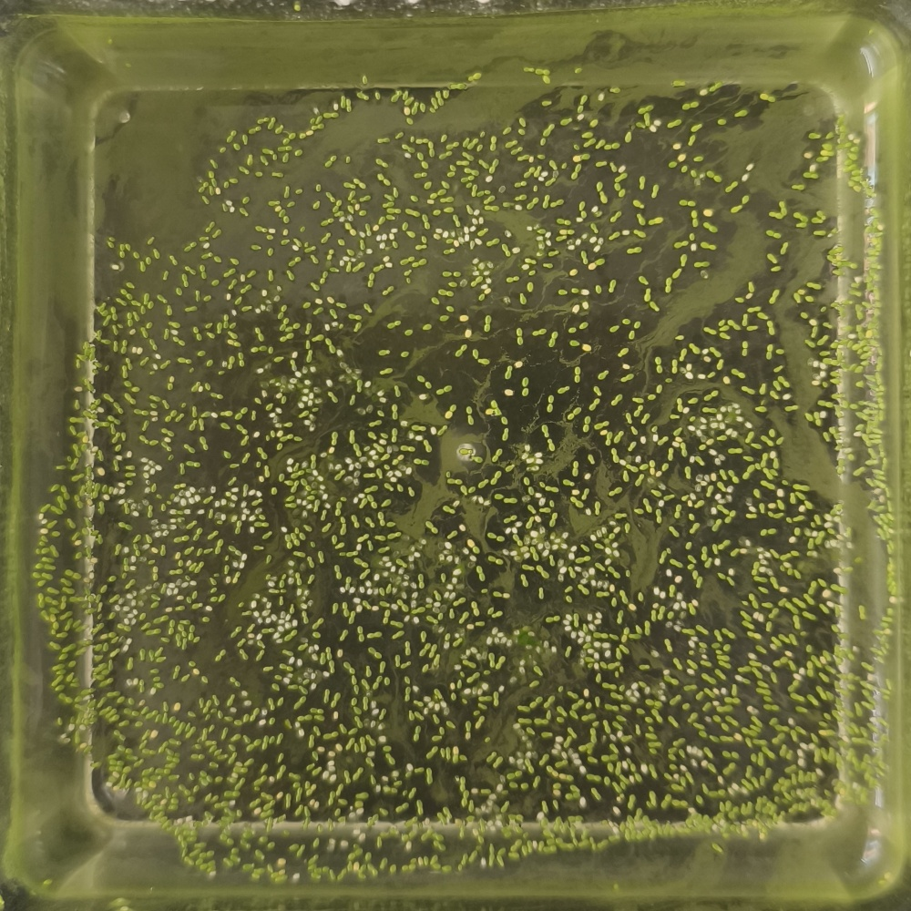
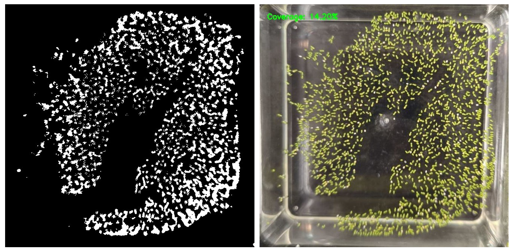

**CDE4301 IS-403**

# 1. Introduction (Shannen) 
**1.1. The Rise of Microgreens and Smart Indoor Farming in Singapore**

&nbsp;&nbsp;&nbsp;&nbsp;&nbsp;&nbsp;Singapore imports over 90% of its food due to limited land, making it vulnerable to global supply disruptions. (Singapore Food Agency, 2023) To improve resilience, there is a growing push to increase local food production, particularly through high-efficiency and space-saving methods. (Begum, 2020) Microgreens, which are fast-growing and nutrient-dense, have emerged as a promising way to boost local food supply. (Singh et al., 2024) Indoor farming enables year-round cultivation in controlled environments using methods such as vertical farming and hydroponics, but high operational costs and labour constraints limit large-scale adoption. (Loh, 2024) To address these issues, there is increasing demand for Agriculture 4.0 technologies, including automation, sensors and data-driven systems, which can improve efficiency, optimize resource use and enhance crop quality. (Begum, 2025a) The Singapore Green Plan 2030 was recently postponed to 2035, with renewed plans to support indoor farms and revised targets to increase production of both vegetables and protein. (Begum, 2025b) As the need for fresh, locally grown produce rises (Tham, 2024), integrating advanced technologies into these production methods become essential for achieving sustainable and scalable local food production.

  **1.2. Problem Statement**

&nbsp;&nbsp;&nbsp;&nbsp;&nbsp;&nbsp;Duckweed is a fast-growing, nutrient-rich microgreen with potential to contribute to sustainable indoor farming and local food production. (Zięć et al., 2025) However, because it is cultivated in water, it is prone to biofilm adhesion, which reduces growth and harms plant health. (Zhang et al., 2010) This presents a key challenge for duckweed cultivation. Addressing biofilm formation and adhesion is therefore critical to ensure healthy duckweed growth and maintain its potential as a sustainable food source. 

  **1.3. Project Objectives**

&nbsp;&nbsp;&nbsp;&nbsp;&nbsp;&nbsp;This project aims to develop a system to detect and remove biofilm forming on duckweed in controlled environments. It begins by evaluating the problem of biofilm on duckweed and current control methods to assess their effectiveness and identify areas for improvement. Different biofilm removal methods will then be compared to identify an approach that is both novel and effective. Based on these findings, the chosen method will be designed and tested, while considering its impact on duckweed growth. Finally, the project will consider its potential use in intensive duckweed cultivation and provide recommendations for future improvements and applications in food production. 

 

# 2. Duckweed (Shannen) 
&nbsp;&nbsp;&nbsp;&nbsp;&nbsp;&nbsp;Duckweed was selected for this project due to its rapid growth, high nutritional content and suitability as a high-efficiency crop in controlled environments. Its rapid doubling time also makes it a practical choice for experiments, as changes in population can be observed over a short period. This section reviews its key characteristics, including physical traits, protein content, clonal reproduction and growth patterns, factors affecting growth and indicators of poor health, providing essential background for addressing challenges such as biofilm formation. 

  **2.1. Physical Characteristics**

&nbsp;&nbsp;&nbsp;&nbsp;&nbsp;&nbsp;Duckweed is a small, fast-growing aquatic plant that floats on the surface of freshwater and reproduces primarily through asexual budding, producing genetically identical plants that contribute to rapid colony formation. It is one of the smallest plants, typically 1-15 mm in length, with simple, flat, oval-shaped fronds. (Ziegler et al., 2023) The fronds are buoyant due to air-filled tissues, which help keep the plant afloat (Chen, 2024) and  form dense mats on the water surface. (Walsh et al., 2021) Duckweed naturally grows in still or slow-moving freshwater bodies and can tolerate a range of environmental conditions. (Thingujam et al., 2024) 

  **2.2. Nutritional Value**

&nbsp;&nbsp;&nbsp;&nbsp;&nbsp;&nbsp;Duckweed is highly nutritious, containing 20-35g of protein per 100g dry weight. (Appenroth et al., 2017) In comparison, Pak Choi, a locally familiar vegetable, contains about 1.4g of protein per 100g fresh weight, which corresponds to roughly 18g per 100g dry weight. (WebMD, n.d.) Duckweed also doubles its biomass within approximately three days, allowing multiple harvests per week (ScienceDirect, 2016), whereas Pak Choi can typically only be harvested every three weeks. (NParks, 2023) This combination of high protein content and fast growth makes duckweed an attractive option for sustainable indoor food production. Already consumed in countries such as Thailand (Zięć et al., 2025), it demonstrates considerable potential as a future food ingredient. 

  **2.3. Clonal Reproduction and Sigmoidal Growth**

&nbsp;&nbsp;&nbsp;&nbsp;&nbsp;&nbsp;Duckweed’s clonal reproduction is closely linked to the classic logistic (sigmoidal) growth model used in population dynamics. (Faizal et al., 2021) Duckweed primarily reproduces through vegetative budding, where a mother frond produces daughter fronds that remain attached briefly before separating. (Zhang et al., 2020) Each new frond is genetically identical, or a clone, and under stable environmental conditions, each frond has roughly the same probability of producing new fronds per unit time. (Ziegler, 2025)

2.3.1. *Lag Phase*

&nbsp;&nbsp;&nbsp;&nbsp;&nbsp;&nbsp;When a new culture is inoculated, there may be a short acclimation period as fronds adjust to the new environment, repair stress and optimize metabolism. (Singh et al., 2025) Population increase is minimal during this phase, which lasts about a day, but fronds are preparing for rapid reproduction. (Faizal et al., 2021) 

2.3.2. *Exponential (Log Phase)*

&nbsp;&nbsp;&nbsp;&nbsp;&nbsp;&nbsp;Once acclimated, each frond buds at its characteristic rate, producing rapid population expansion. (Yang, 2022) Because reproduction is independent of mating, growth can be very fast, with doubling times as short as 1 to 3 days depending on conditions. (Coughlan et al., 2022) This rapid growth allows duckweed to quickly cover the water surface. 

2.3.3. *Plateau (Stationary) Phase*

&nbsp;&nbsp;&nbsp;&nbsp;&nbsp;&nbsp;Exponential growth cannot continue indefinitely. As the mat thickens and density increases, growth slows due to density-dependent factors such as self-shading and waste accumulation. (Walsh et al., 2021)

  **2.4. Factors Affecting Growth**

&nbsp;&nbsp;&nbsp;&nbsp;&nbsp;&nbsp;Several environmental and physiological factors influence duckweed growth in controlled systems. Light intensity and photoperiod affect photosynthesis and biomass accumulation, while temperature influences metabolic rates and reproduction speed. (Islam et al., 2025) Nutrient availability, particularly nitrogen, phosphorus and micronutrients, directly impact frond production and protein content. (Ruvini Hiththatiyage et al., 2026) Water quality parameters such as pH and the presence of toxins or pollutants can also limit growth. (Jones et al., 2023) Additionally, overcrowding and self-shading in dense mats can slow reproduction, (Walsh et al., 2021) while the accumulation of microbial films on the fronds can further inhibit growth. (Zhang et al., 2010) 

  **2.5. Indicators of Poor Growth**

&nbsp;&nbsp;&nbsp;&nbsp;&nbsp;&nbsp;Poor duckweed growth can be identified through several observable signs. Healthy fronds float on the water surface, but stressed or unhealthy ones may produce turions, which sink, indicating reduced buoyancy or survival strategy under stress. (Ziegler et al., 2023) Discolouration, such as white or yellowed fronds, can signal nutrient deficiencies, disease or environmental stress. (Bunyoo et al., 2022)

 

# 3. Biofilm (Shannen) 
&nbsp;&nbsp;&nbsp;&nbsp;&nbsp;&nbsp;Biofilms originate from microorganisms naturally present in water, including bacteria, fungi, algae and protozoa, which can attach to any suitable surface in a moist environment. (Ali et al., 2023) These microorganisms secrete a self-produced matrix called extracellular polymeric substances (EPS), made of polysaccharides, proteins, DNA and water, which protects the community and enables its expansion. (Zhao et al., 2023) While environmental parameters can be precisely controlled in indoor cultivation systems, biofilm readily establishes and exhibits high resilience, presenting a significant challenge to maintaining healthy duckweed culture. This section examines the growth of biofilm and its negative interactions with duckweed.

  **3.1. Physical Characteristics**

&nbsp;&nbsp;&nbsp;&nbsp;&nbsp;&nbsp;Duckweed is a small, fast-growing aquatic plant that floats on the surface of freshwater and reproduces primarily through asexual budding, producing genetically identical plants that contribute to rapid colony formation. It is one of the smallest plants, typically 1-15 mm in length, with simple, flat, oval-shaped fronds. (Ziegler et al., 2023) The fronds are buoyant due to air-filled tissues, which help keep the plant afloat (Chen, 2024) and  form dense mats on the water surface. (Walsh et al., 2021) Duckweed naturally grows in still or slow-moving freshwater bodies and can tolerate a range of environmental conditions. (Thingujam et al., 2024) 

  **3.2. Stages of Biofilm Development**

&nbsp;&nbsp;&nbsp;&nbsp;&nbsp;&nbsp;Biofilm formation occurs in five main stages. It begins with the attachment stage, where free-floating bacteria loosely adhere to surfaces through weak forces like van der Waals interaction and electrostatic attraction. This is followed by irreversible adhesion as bacteria anchor and initiate production of the EPS. Next, in the microcolony formation stage, the attached bacteria proliferate and aggregate into small clusters. During the maturation stage, the biofilm develops into a complex three-dimensional structure with the microcolonies. Finally, in the dispersion stage, some bacteria detach to colonise new surfaces, allowing biofilms to spread and re-establish elsewhere. (Ugwu et al., 2025) 

  **3.3. Sources and Growth Drivers**

&nbsp;&nbsp;&nbsp;&nbsp;&nbsp;&nbsp;In duckweed cultivation, microorganisms are readily introduced through the water source, nutrient solutions or handling of the plants. (An et al., 2024) Biofilm formation is driven by the presence of available surfaces for attachment, sufficient moisture and nutrients that sustain microbial metabolism. (Ugwu et al., 2025) Environmental conditions common in cultivation, such as stagnant water, warm temperatures and high nutrient conditions, further accelerate biofilm development. (Li et al., 2023) 

  **3.4. Negative Impact of Biofilm Adherence on Duckweed Growth**

&nbsp;&nbsp;&nbsp;&nbsp;&nbsp;&nbsp;Although biofilms can be beneficial in some contexts such as stabilising ecosystems, recycling nutrients or supporting beneficial microbial communities (Musa et al., 2024), they are detrimental to duckweed cultivation in controlled systems. On duckweed fronds, biofilms adhere to the plant surface, physically obstructing frond reproduction (Zhang et al., 2010) and hindering nutrient uptake, leading to slower growth and lower biomass. Additionally, biofilms can harbour competing or pathogenic microbes, further compromising plant health (An et al., 2024) and potential for safe consumption. (Zięć et al., 2025) Although a dense duckweed population can partially limit biofilm accumulation (Beitle et al., 2025), this comes at the cost of reduced productivity and continued negative impacts on overall crop performance.

 

# 4. Value Proposition (Shannen) 
&nbsp;&nbsp;&nbsp;&nbsp;&nbsp;&nbsp;	To address the problem of biofilm in duckweed cultivation, we identified stakeholders impacted and evaluated current management measures, recognising that existing methods are few, disruptive and labour-intensive. The proposed system aims to explore novel biofilm removal methods.

  **4.1. Stakeholder Analysis**

&nbsp;&nbsp;&nbsp;&nbsp;&nbsp;&nbsp;We were inspired by Dr Yuchen Long’s research on duckweed and visited his lab, where he shared that he encountered significant biofilm contamination while cultivating duckweed. He explained that biofilm can rapidly cover plant surface and system components, competing with duckweed for nutrients, oxygen and light, while also harbouring potentially harmful microorganisms, and is difficult to remove once established. Currently, the lab uses bleaching to control biofilm, which risks damaging the crop, highlighting the need for alternative solutions to support healthy duckweed growth. 

&nbsp;&nbsp;&nbsp;&nbsp;&nbsp;&nbsp;In line with Singapore’s goal of strengthening local food production, the primary stakeholders of the project are indoor farming operations, which require efficient and reliable systems to maintain microgreen cultivation. (EDB Singapore, 2025) These users would benefit from improved biofilm management, resulting in higher productive and reduced reliance on labour-intensive or potentially damaging control methods. Farm technicians and workers are also key stakeholders as they are responsible for operating and maintaining the system. 
	
&nbsp;&nbsp;&nbsp;&nbsp;&nbsp;&nbsp;Secondary stakeholders include researchers and R&D institutions who are interested in advancing duckweed cultivation and biofilm management strategies. In addition, consumers represent a broader stakeholder group, benefiting from safer and more sustainable food production enabled by improved cultivation practices.		

  **4.2. Current Biofilm Management Techniques**

&nbsp;&nbsp;&nbsp;&nbsp;&nbsp;&nbsp;Currently, no commercial or standardised systems provide real-time detection and removal of biofilm from duckweed fronds. While laboratory protocols exist for sterilisation of duckweed and hydroponic technologies can manage general biofilm, there is no integrated solution that combines continuous monitoring with duckweed-specific biofilm control.

4.2.1. *Lab Protocols for Biofilm Removal*

&nbsp;&nbsp;&nbsp;&nbsp;&nbsp;&nbsp;Laboratory protocols have been developed specifically for duckweed, focussing on surface sterilisation and gentle rinsing, where fronds are briefly soaked in dilute sodium hypochlorite (~1% bleach) followed by multiple rinses to remove surface microbes and loose biofilm. (Laurich, 2019) 

4.2.2. *Biofilm Management in Hydroponics Systems*

&nbsp;&nbsp;&nbsp;&nbsp;&nbsp;&nbsp;In broader hydroponic systems, biofilm is managed using physical and mechanical methods, such as scrubbing or flushing surfaces, ultrasonic or sound-based disruption and UV. (Mehmood et al., 2025) Chemical interventions are also commonly applied. (An et al., 2024) 

4.2.3. *Current Biofilm Detection Methods*

&nbsp;&nbsp;&nbsp;&nbsp;&nbsp;&nbsp;Microscopical and imaging methods are among the most commonly used for biofilm detection, enabling direct visualisation of biofilm structure and thickness. In addition, biological approaches such as colony-forming unit assays, are also employed to estimate viable microbial populations by culturing biofilm cells on agar plates. Chemical techniques use staining assays and analysis of EPS or metabolic activity to quantify biofilm presence. (Achinas et al., 2020) Optical and spectroscopic methods further complement these techniques by quantifying biofilm growth through changes in light absorption, reflection or molecular composition. (Kulshrestha & Gupta, 2024) More recently, sensor-based and physical detection methods have emerged, including optical fibre sensors (Rakhimbekova et al., 2022) and capacitive sensors. (Zirk et al., 2022)

  **4.3. Gaps in Existing Approaches and Our Proposed Solution**

4.3.1. *Evaluation of Current Biofilm Management Methods*

&nbsp;&nbsp;&nbsp;&nbsp;&nbsp;&nbsp;Laboratory protocols for duckweed are not suitable for continuous or large-scale cultivation. These methods are labour-intensive and may disrupt normal duckweed growth if applied repeatedly, while also failing to prevent rapid re-establishment of biofilm due to the chemical resistance of the EPS matrix. (Hasan & Aggarwal, 2024) In hydroponic systems, existing mechanical methods could potentially be adapted to remove biofilm from duckweed surfaces without relying on harsh chemicals that pose safety concerns for human consumption. (An et al., 2024)

4.3.2. *Evaluation of Current Biofilm Detection Methods*

&nbsp;&nbsp;&nbsp;&nbsp;&nbsp;&nbsp;Laboratory methods, such as microscopy and imaging, provide detailed visualisation of biofilm structure but are destructive, labour-intensive and unsuitable for continuous monitoring. Similarly, biological approaches can quantify viable microbes but they are slow and do not capture non-culturable cells or the EPS matrix. Chemical techniques can detect and quantify biofilm more directly, yet they require sampling and cannot provide real-time feedback. (Achinas et al., 2020) In contrast, optical and sensor-based approaches show the most promise for monitoring biofilm on duckweed. Optical techniques allow non-invasive and rapid tracking of biofilm growth and composition (Kulshrestha & Gupta, 2024), while emerging sensors can provide real-time and non-destructive detection. (Rakhimbekova et al., 2022) 

4.3.3. *Limitations Addressed*

&nbsp;&nbsp;&nbsp;&nbsp;&nbsp;&nbsp;We propose an integrated, real-time system specifically designed for duckweed cultivation. The approach uses camera-based imaging to continuously monitor biofilm formation on duckweed fronds. Image analysis algorithms quantify biofilm growth and trigger a signal when biofilm exceeds set thresholds. This signal then activates a mechanical removal mechanism to eliminate biofilm from the plant surface. By combining automated detection with targeted mechanical removal, the system provides non-destructive, continuous, real-time biofilm management while reducing labour requirements. 

 

# 5. Methods (Jingten)

&nbsp;&nbsp;&nbsp;&nbsp;&nbsp;&nbsp;To identify potential concept solutions, we established a set of protocols to ensure accurate evaluation. Duckweed cultures were set up in controlled lab environments, with initial biomass was standardised to enable consistent comparison. Growth was monitored using a camera-based imaging system, while duckweed health was assessed manually before and after biofilm removal. Biofilm removal interventions were carried out at the appropriate time and data were analysed by comparing treated and untreated cultures to assess the effectiveness of intervention and duckweed growth. 

  **5.1. Duckweed Culture Setup** 

(insert picture of set up) 

&nbsp;&nbsp;&nbsp;&nbsp;&nbsp;&nbsp;Duckweed cultures were maintained for 7 days, under controlled laboratory conditions to ensure reproducibility and accurate evaluation of interventions. Cultures were grown in 5cm by 5cm square containers with a 10 cm height. Environmental conditions were maintained at a temperature of 23°C, with a long day light cycle (16 hours light, 8 hours dark). The growth medium had a pH of 7.5 and was prepared according to the composition detailed in table X below. 

|Stock Compound | Concentration (mM) |
| :--- | :--- |
| Monopotassium Phosphate | 0.15 |
| Calcium Nitrate Tetrahydrate | 1.00 |
| Potassium Nitrate   | 8.00 |
| Manganese (II) Chloride Dihydrate  | 0.013 |
| Boric Acid   | 0.005 |
| Sodium Molybdate Dihydrate  | 0.0004 |
| Magnesium Sulfate Heptahydrate  | 1.00 |
| Ethylenediaminetetraacetic Acid   | 0.025 |

Table X: Composition of Growth Medium

  **5.2. Growth Monitoring** 

&nbsp;&nbsp;&nbsp;&nbsp;&nbsp;&nbsp;Images were captured once per day to monitor duckweed growth, frond surface coverage and biofilm formation. Daily imaging was selected as duckweed has a rapid growth rate, with noticeable changes occurring within short time periods. 

5.2.1. *Initial Biomass Standardisation*

&nbsp;&nbsp;&nbsp;&nbsp;&nbsp;&nbsp;Standardising the initial biomass ensures that all cultures start with a comparable population of fronds, which is critical for accurately evaluating growth and biofilm intervention. Small differences in starting population can lead to large divergences in growth over time, especially during the exponential phase. Starting with consistent biomass allows for reliable comparison of growth rates, frond coverage and responses to biofilm removal across treatments. It also ensures that each culture enters the lag, exponential and plateau phases under comparable conditions, so differences observed in growth or health are due to experimental variables, not initial population size. Without standardisation, variations in initial biomass could mask or exaggerate the effect of intervention strategies, reducing the accuracy and reproducibility of results. 

&nbsp;&nbsp;&nbsp;&nbsp;&nbsp;&nbsp;To standardise initial biomass, we first spread the duckweed fronds evenly across the cultivation tank. For even distribution, we 3D-printed a cross-shaped divider that divides the tank into four quadrants, allowing us to place fronds uniformly in each section. This ensured that all cultures started with comparable population density.

5.2.2. *Camera System for Growth Rate Measurement* 

&nbsp;&nbsp;&nbsp;&nbsp;&nbsp;&nbsp;A smartphone camera was used to capture images of the water surface. The setup was placed under consistent lighting to minimise shadows and reflections that could affect image analysis. A calibration scale was included in each image to ensure accurate measurement of surface area and coverage. Images were stored on the device and later transferred to a computer for processing using a python application.

5.2.3. *Data Collection for Comparison of Growth Rates* 

&nbsp;&nbsp;&nbsp;&nbsp;&nbsp;&nbsp;Day 1 reflects the lag phase (Faizal et al., 2021) while days 2-7 represent the exponential phase. Because growth rates vary across these three phases, only the exponential phase was used to compare the effects of the interventions on growth rate. 

5.2.4. *Duckweed Health Assessment* 

&nbsp;&nbsp;&nbsp;&nbsp;&nbsp;&nbsp;Since duckweed typically grows in still water, any mechanical intervention must account for the movement it generates, as excessive agitation could damage fronds or affect buoyancy. Duckweed health was evaluated manually before and after biofilm removal interventions. Observations focused on key indicators such as yellowing or pale fronds and sinking behaviour which reflect stress. These assessments provided qualitative data on plant health and allowed evaluation of any negative impacts caused by biofilm formation or the mechanical removal process. 

  **5.3. Biofilm Intervention Timing** 
	
(insert pictures of no biofilm, day 3 biofilm and thicker biofilm in later days)

&nbsp;&nbsp;&nbsp;&nbsp;&nbsp;&nbsp;Biofilm removal was applied on day 3 of cultivation, corresponding to the early exponential growth phase of duckweed and initial stage of biofilm formation. At this stage, fronds are rapidly reproducing and most sensitive to disruptions in light and nutrient uptake. (Ziegler et al., 2023) Biofilm is in the early irreversible adhesion phase, appearing as a thin, slightly cloudy film on the surface of duckweed fronds and has not developed into a dense and resistant structure. (Bravo et al., 2023) The preceding reversible stage was not targeted, as microbial attachment is transient, weakly bound and difficult to detect or remove efficiently in real time. (Li et al., 2021) Targeting the early irreversible stage maximises removal effectiveness while minimising impact on plant growth. The biofilm is still thin and weakly established, allowing it to be removed without the need for harsh chemicals or strong physical forces that could damage the duckweed fronds. 

  **5.4. Data Analysis** 

*Figure X. Image analysis of duckweed fronds. Right shows image of an observation of duckweed tank, with the percentage coverage in dicated on the top left. Left shows a masked layer on the duckweed fronds area. 

&nbsp;&nbsp;&nbsp;&nbsp;&nbsp;&nbsp;Data from the camera-based growth monitoring were analysed. Surface coverage and growth rate were quantified for each experimental tank and treated cultures were compared to untreated controls based on these measurements. Duckweed health was recorded qualitatively before and after interventions. This approach allowed assessment of the effectiveness of biofilm removal on duckweed growth while providing qualitative insights into plant conditions. 

&nbsp;&nbsp;&nbsp;&nbsp;&nbsp;&nbsp;The surface coverage was quantified by percentage coverage. First, the image was cropped to standardize the total surface area. Duckweed were defined by circular edge and green color, and through edge detection and defining hsv ranges, a mask was applied on the duckweed to quantify the coverage area in each image. As the app recognizes duckweed as green, unhealthy white duckweed was excluded from the area coverage.

 

# 6. Potential Concept Solutions (Jingten)

&nbsp;&nbsp;&nbsp;&nbsp;&nbsp;&nbsp;For preliminary testing of potential concept solutions, we followed the protocol outlined in Section 5. This section presents the intervention methods we selected, the rationale for each and how they were evaluated. Evaluation criteria includes the effectiveness of biofilm removal from the duckweed fronds, improvements in growth rate, impact on duckweed health and the feasibility of implementing the method in larger-scale cultivation systems.

 **6.1. Loofah-based Filtration System** 

6.1.1. *Hypothesis and Rationale*

&nbsp;&nbsp;&nbsp;&nbsp;&nbsp;&nbsp;Loofah is the fibrous, dried fruit of plants in the cucumber family (Cucurbitacaea) (Gong et al., 2024), consisting of a dense three-dimensional network of cellulose-based fibres. Its porous, lightweight and biodegradable structure makes it commonly used as a sponge (Chen et al., 2017) , while also serving as a low-cost support material in engineering and environmental systems. (Lei et al., 2025) 

&nbsp;&nbsp;&nbsp;&nbsp;&nbsp;&nbsp;In biofilm-related applications, loofah has been widely used in wastewater treatment systems due to its ability to support microbial attachment. (Lago et al., 2024) Its highly porous and fibrous structure provides a large surface area that promotes the adhesion and growth of microorganisms, enabling the formation of stable biofilms while maintaining good water flow. (Dang et al., 2020) 

&nbsp;&nbsp;&nbsp;&nbsp;&nbsp;&nbsp;These same properties suggest that loofah can be repurposed for biofilm removal. Its high surface area and rough microstructure provide numerous attachment sites (Sajjad et al., 2022), while its hydrophilicity, cellulose-rich surface enhances microbial adhesions. (Lei et al., 2025) Additionally, its porous structure allows duckweed to pass through with minimal resistance, enabling filtration without significant disruption. 

6.1.2. *Preliminary Experiment* 

&nbsp;&nbsp;&nbsp;&nbsp;&nbsp;&nbsp;Given the complex structure of a loofah, a preliminary experiment was done to identify the optimal cut section used for filtration. 

*Figure X. Exploration of Optimal Loofah Filter Surface. The loofah was cut along the dotted line to create surface b and c. (a) Transverse section of loofah as filter. (b) Longitudinal section from outer surface of loofah as filter. (c) Longitudinal section from inner surface of loofah as filter.*

&nbsp;&nbsp;&nbsp;&nbsp;&nbsp;&nbsp;The experiment was conducted using a biofilm substitute made from sodium alginate and calcium chloride, which has a similar structure as the algal biofilm found in the duckweed tank during the problem identification phase. (Borchard et al., 2005) By creating a biofilm substitute of different sizes, the biofilm retention ability of the loofah on different surfaces was quantified by the increase in wet mass after filtering water containing the biofilm substitute. 

&nbsp;&nbsp;&nbsp;&nbsp;&nbsp;&nbsp;The results showed significantly higher increase in wet mass in surface c, where the biofilm is trapped deep within the matrix of the loofah sponge when inspected visually. When filtered using surface a and b, the biofilm was only stuck near the surface of the matrix, and the porous structure of the loofah was disrupted by the biofilm. This suggests that a and b had a higher chance of clogging the filter, requiring frequent maintenance and upkeep, and filters at a lower efficiency. Based on the results, the next experiment was conducted using the inner surface of the loofah sponge.

6.1.3. *Experiment* 

(insert picture of loofah filtration experiment)

&nbsp;&nbsp;&nbsp;&nbsp;&nbsp;&nbsp;We proceed to investigate the effect of loofah on duckweed growth rate. The experiment was set up with a clean control and a biofilm-infected control to be observed without any intervention. For the intervention, the duckweed culture, along with growth medium, was poured through a loofah or a kitchen sponge into a separate tank. A control setup was prepared by pouring an equivalent amount of duckweed culture directly into another tank without passing through the loofah to understand how pouring disrupts the duckweed growth.

6.1.4. *Results* 

&nbsp;&nbsp;&nbsp;&nbsp;&nbsp;&nbsp;We were not able to accurately compare the growth data due to a reduction in initial duckweed density after filtration, as some fronds were retained by the loofah. As a result, it is difficult to determine whether a change in growth rate was due to effective biofilm removal or simply reduced competition from lower biomass. Additionally, some fronds turned white after filtration, indicating stress or potential damage caused by mechanical handling. 
	
6.1.5. *Evaluation*

&nbsp;&nbsp;&nbsp;&nbsp;&nbsp;&nbsp;A key limitation of this method is that duckweed fronds were retained within the loofah during filtration. Although attempts were made to recover trapped fronds using distilled water, complete retrieval was not achieved, resulting in a reduction in biomass. Furthermore, the amount of biofilm removed may also vary between trials, depending on factors such as flow rate, pouring technique and how the loofah is packed, which affects reproducibility. While visual inspection suggested effective removal, some biofilm may remain on fronds. Over time, the loofah could become saturated with biofilm, reducing its effectiveness and requiring replacement. These factors, combined with labour requirements and potential biomass loss, limit the scalability and consistency of the method for larger cultivation systems. 

 **6.2. Surface Agitation**

6.2.1. *Hypothesis and Rationale*

&nbsp;&nbsp;&nbsp;&nbsp;&nbsp;&nbsp;Surface agitation involves physically stirring the duckweed culture to generate localised shear forces on the frond surfaces, disturbing growth of microorganisms. (Zhou et al., 2018) By gently moving the water around the plants, the biofilm in the early irreversible adhesion phase and loosely attached microbial aggregates can be dislodged. This method targets the interface between the frond and surrounding medium, disrupting developing microcolonies before the EPS matrix fully matures. However, the common practice of duckweed farming is to maintain a calm surface since agitation might disrupt duckweed growth.

6.2.2. *Experiment* 

&nbsp;&nbsp;&nbsp;&nbsp;&nbsp;&nbsp;Duckweed cultures were subjected to two conditions: a stirred treatment and an unstirred control. In the stirred treatment, a spatula was gently moved through the medium and frond surfaces. The unstirred control was left undisturbed to allow natural biofilm formation. 
(insert picture of surface stirring experiment)

6.2.3. *Results* 
| Day | 2 | 3 | 4 | 5 | 6 |
| :--- | :--- | :--- | :--- | :--- | :--- |
| Control | 4.53 | -3.66 | 9.61 | -10.9 | 13.0 |
| Surface Agitation | -1.98 | 13.1 | 0.35 | 0.97 | 7.80 | 

Table X. Growth Rates in Control and Surface Agitation Experiments from Day 2-6

&nbsp;&nbsp;&nbsp;&nbsp;&nbsp;&nbsp;The intervention effectively removed some biofilm from the duckweed surface. Additionally, the duckweed showed no signs of discolouration or sinking, indicating minimal impact to its health. As shown in Table X, the growth rate was the highest on day 3 following the intervention, but this effect was not sustained. After day 3, the growth rate declined significantly, suggesting that residual biofilm on the surface near the duckweed continued to affect its growth. In comparison, the control exhibited duckweed sinking and a negative growth rate, making direct comparison with the intervention unreliable. 

6.2.4. *Evaluation*

&nbsp;&nbsp;&nbsp;&nbsp;&nbsp;&nbsp;Although some biofilm was successfully removed, the intervention alone is insufficient to fully control biofilm growth. Once detached, microbial cells remain in the medium and can reattach to fronds, allowing biofilm to redevelop. This highlights the need for an additional removal or containment mechanism to capture the dislodged biofilm, preventing it from sticking to duckweed again. Without such a system, repeated agitation may provide only temporary relief and biofilm can rapidly re-establish, limiting the effectiveness of the intervention. 

 **6.3. Magnetic Stirrer**

6.3.1. *Hypothesis and Rationale*

&nbsp;&nbsp;&nbsp;&nbsp;&nbsp;&nbsp;A magnetic stirrer generates a shear force without highly disturbing the surface. A controlled vortex induces fluid motion and mixing throughout the liquid, with flow patterns depending on the rotation speed of the stir bar. (Halász et al., 2007) In biofilm systems, this shear can detach loosely adhered microbial cells and disrupt early-stage biofilm, during the irreversible phase. The vortex allows suspended particles and biofilm fragments to be lifted from the fronds without requiring direct mechanical contact, increasing the chance of detachment. (Jang et al., 2017) Because the fluid motion is evenly distributed, it can reach areas that are difficult to access with localised mechanical methods, providing a more uniform intervention. (Borosil Scientific, 2025) Some of the detached biofilm may settle toward the bottom of the tank due to gravity and vortex movement, reducing the amount of biofilm in contact with duckweed surfaces. (Glover & Fitzpatrick, 2007) In contrast, simply stirring the tank without a controlled vortex may only move water locally, causing uneven detachment and less predictable settling of biofilm fragments.

6.3.2. *Experiment* 

&nbsp;&nbsp;&nbsp;&nbsp;&nbsp;&nbsp;Duckweed cultures were subjected to two conditions: a stirred treatment and an unstirred control. In the stirred treatment, a magnetic stirrer generated a continuous vortex throughout the medium, applying shear forces to both the water column and frond surfaces. The unstirred control was left undisturbed to allow natural biofilm formation. 

6.3.3. *Results* 
| Day | 2 | 3 | 4 | 5 | 6 |
| :--- | :--- | :--- | :--- | :--- | :--- |
| Control | 4.53 | -3.66 | 9.61 | -10.9 | 13.0 |
| Magnetic Stirrer | 11.1 | 13.3 | 7.17 | 7.31 | 7.80 |

Table X. Growth Rates in Control and Magnetic Stirrer Experiments from Day 2-6

&nbsp;&nbsp;&nbsp;&nbsp;&nbsp;&nbsp;The intervention effectively removed most biofilm from the duckweed surface. Additionally, the duckweed showed no signs of discolouration or sinking, indicating minimal impact to its health. As shown in Table X, the growth rate was the highest on day 3 following the intervention and this effect was sustained. After day 3, growth rates decreased slightly, suggesting that as the biofilm settled below, it had less impact on the duckweed. In comparison, the control exhibited duckweed sinking and a negative growth rate, making direct comparison with the intervention unreliable. 

6.3.4. *Evaluation*

&nbsp;&nbsp;&nbsp;&nbsp;&nbsp;&nbsp;The magnetic stirring intervention worked well, effectively dislodging most biofilm from duckweed surfaces and spinning fragments down toward the bottom of the tank. However, larger biofilm fragments still remained on the surface. This is consistent with the need to remove the biofilm when the EPS is still in its early stages of development. While further work is needed to optimize removal and settlement, it has the potential to be scaled and automated. Since the detached biofilm can settle, a method could be developed to contain and remove it efficiently.

 

# 7. Optimization of Chosen Concept Solution: Magnetic Stirrer (Jingten)

&nbsp;&nbsp;&nbsp;&nbsp;&nbsp;&nbsp;We selected the magnetic stirrer as the preferred intervention because it effectively dislodged biofilm and allowed fragments to settle, resulting in the greatest improvement in growth rate. Compared to the other two methods, it also performed best in terms of biofilm removal, health, and potential for implementation. The focus of optimisation is now on fine-tuning vortex speed to maximise biofilm detachment while minimising stress or damage to the duckweed, ensuring an effective and balanced intervention. 

 **7.1. Experimental Method** 

&nbsp;&nbsp;&nbsp;&nbsp;&nbsp;&nbsp;To optimize the magnetic stirrer, we conducted an experiment for stirring at different speeds for duckweed with biofilm. To ensure a fair comparison, key variables were kept constant across all trials, including tank volume, stir bar size and the position of the stir bar. Biofilm removal was assessed through visual observation of detachment from duckweed fronds. 

 **7.2. Optimisation of Vortex Speed**

&nbsp;&nbsp;&nbsp;&nbsp;&nbsp;&nbsp;While higher vortex speeds generate stronger shear forces that improve the removal of EPS (Hasan & Aggarwal, 2024), they can also negatively affect duckweed by causing physical stress. To evaluate this trade-off, experiments were conducted at two different speeds 600 rpm and 870 rpm, where the higher speed prioritizes biofilm removal and disturbs the surface slightly while the lower speed ensures that the surface disturbance is minimal during the vortex. 

&nbsp;&nbsp;&nbsp;&nbsp;&nbsp;&nbsp; It was observed that biofilm removal improved at 870 rpm. However, the vortex may have been too strong, as some discolouration was observed after the intervention. Further testing within the range of 600 to 870 rpm is needed to ensure that duckweed health is maintained. 

 

# 8. Final Design Specifications (Isaac) 

  **1.4. Interaction between Cyanobacteria and Duckweed**

 Figure A: Duckweed Cultivation with Cyanobacteria and Algae 

2.3.1. *Practical Considerations*

| |  |
| :--- | :--- |
|  **Affordability** | The unit price should remain below SGD $1,000 to ensure accessibility for SMEs to encourage adoption. The lowest price on the market is USD [1,9951](#footnote-1). |
|  **Portability** | The sensor must be compact and lightweight to support relocation within multi-tank facilities. Transfers should be quick and non-disruptive to farming operations.  |
| **Ease of use** | The sensor should be simple to operate for users with minimal technical training. Sensor readings and real-time cyanobacteria concentrations must be easily accessible and clearly interpreted. This includes an intuitive user interface, clear display of results and guided workflow. Furthermore, users can collect readings without disturbing the duckweed or water system.  |

2.3.2. *Technical Considerations*

| |  |
| :--- | :--- |
|  **Detection Limits** | The sensor must detect cyanobacteria concentrations low enough to prevent harmful effects on duckweed. Growth and chlorophyll content of duckweed decrease significantly at 0.075 μg/mL =7.5106 cells/mL. (Saqrane et al., 2007) Therefore, the system must trigger alerts at or below this threshold to ensure early intervention.  |
|  **Ease of Maintenance** | The device should remain functional with minimal servicing effort and without requiring users to handle water or internal components. Maintenance procedures must be simple, safe and infrequent.   &nbsp;&nbsp;- Accessible components: no need for users to submerge their hands or remove the sensor fully from the system.  &nbsp;&nbsp;- Long operational lifespan: battery designed to last 3 months without replacement or charging.   &nbsp;&nbsp;- Regular sampling: assuming cyanobacteria can double every 1.5-2 hours under favourable conditions (Wend et al., 2022), the measurements will be taken at least once every 3 hours to capture exponential growth phases.   &nbsp;&nbsp;- Minimal calibration: system calibration should remain stable over time with clear prompts when checks are needed.   |
| **Filter Specification** |The filter should effectively separate duckweed from the water to be filtered, and the cyanobacteria should be removed from the filtered water.   |

# 3. Detail Design 
Our proposed design is made out of three components.

|Component | Description |
| :--- | :--- |
|  **Sensor** | Measures the absorbance of water in duckweed tanks at 620nm correlated to the phycocyanin pigment in cyanobacteria. |
|  **Calibration and Processing** | Translates the absorbance readings measured by the sensor into cyanobacteria count.  |
| **Filter** | Removes the cyanobacteria from the duckweed tank.  |

3.1.2. *Development of the Optical Sensor* (Isaac)

We have developed 4 concepts and will assess which concept best addresses the design requirements.

Submerged Long Term (LT) Line Power

Submerged Battery Inductive

Separated External Line Power

Separated External Battery

| | Line Power | Battery |
| :--- | :--- | --- |
|  **Submerged Unified** | Submerged Long Term (LT) Line Power | Submerged Battery (inductive) |
|  **Separated External** | Separated External Line Power | Separated External Battery |

| | Submerged Long Term [LP2](#footnote-2) | Submerged Battery Inductive | Separated External LP | Separated External Battery |
| :--- | :--- | --- | --- | --- |
|  **Affordability** | ++ | + | ++ | ++ |
|  **Ease of Set Up** | + | +++ | ++ | ++ |
|  **Operational Endurance** | +++ | ++ | +++ | ++ |
|  **Ease of maintenance** | + | ++ | ++ | ++ |
|  **Accuracy (all with the same internals)** | ++ | ++ | ++ | ++ |
|  **Ease of measurement and viewing of results** | + (no 7 segment display, direct connection to computer) | + (no 7 segment display, direct connection to computer)| ++ (have 7 segment / LCD display) | ++ (have 7 segment / LCD display) |
|  **Portability** |+ | +++ | ++ | ++ |
|  **Total Score** | 11 | 14 | 15 | 16 |

**Analysis of Concept Variations (Isaac)**

 Figure B: Submerged Unified Long Term (LT) Line Power 

This design is simple and straightforward with direct line power to a submerged sensor. It has operational endurance as it is place-and-forget. However, it is not portable and cannot be moved from tank to tank easily to take different measurements. 

 Figure C: Submerged Unified Battery Inductive design 

A variation of the first design is a submerged sensor that is inductively powered. This has good operational endurance as the sensor can be inductively powered and is less logistically complex, without power supply entering the water from the mains. However, it will be less affordable due to the inductive charger and better waterproofing is required as it is submerged.  

 Figure D: Separated external line power 

To improve on this design, the sensor can be mounted on the side of the tank and the sampling mechanism is a tube that is suspended in the water. This requires less waterproofing for the sensor, however, it is externally powered. It will be affordable. 

 Figure E: Separated External battery 

The last and final design we decided on is the separated external sensor with a inbuilt battery. This gives the best balance of portability (ease of transferring the sensor to another tank), and ease of maintenance as the battery removal is convenient on the outside of the tank. 

**Detailed Design of Sensor Module**

 Figure F: Integrated cyanobacteria spectral sensor with display and sampling mechanism 

The sensor comprises of 9 key components, divided into 4 systems. Sampling, Measurement and Computation, Power Management and Display.

**Sampling System**

Cuvette
Small peristaltic fluidic pump
Full Spectrum LED
620 nm Filter
Full Spectrum CMOS sensor

**Measurement and Computation**

Raspberry Pi Zero 2 W

**Power Management**

LiPo Battery 8000mAh
ESP 32 Microcontroller

**Display**

7 Segment LED Screen

**Operational Cycle**
1. Water is deposited using the small fluidic pump from the tank into the cuvette
2. Full Spectrum LED iluminates sample, light passes through cuvette and 620nm bandpass filter to CMOS sensor
3. Intensity of light is logged
4. Raspberry pi Zero 2 W calculates and outputs the cyanobacteria concentration.
5. Readings are displayed on 7 segment LED screen.

3.1.3. *Points of Consideration* (Jingten) 

 

 Figure G: Cyanobacteria in Water Column Layers (Erratt et al., 2022) 

1. Location of the sensor (depth)
2. Numbers of sampling sites

&nbsp;&nbsp;&nbsp;&nbsp;&nbsp;&nbsp;As the sensor plays the pivotal role to trigger any actions, it is important that the value detected is representative of the whole duckweed tank. While most cyanobacteria bloom occurs on the surface, cyanobacteria are not limited to the epilimnion layer of the water body. (Erratt et al., 2022)  Toxin-producing cyanobacteria could be present throughout the water column, and the density at which they occur could vary. (de Boutray et al., 2011) Therefore we have to consider whether to homogenize the water right before sampling for a generalized sample, or to further consider the location in which the sensor is placed and the number of sampling sites that would produce a reliable, unbiased value. 

  **3.2. Calibration Curve Relating Absorbance and Concentration of Cyanobacteria** (Shannen) 

 Figure H: Flowchart of Calibration Curve Creation 

3.2.1. *Cell Culture*

1. Prepare 50 mL of growth medium in a flask using the same nutrient composition for duckweed growth.
2. Use a portion of the duckweed culture solution as the inoculum to initiate the cyanobacteria culture.
3. Cover the culture using parafilm to prevent contamination.
4. Allow the culture to grow in the same temperature and light conditions used for duckweed.
5. Take regular measurements to determine when the culture concentration reaches 1x108 cells/mL, using the cell counting protocol below.
6. Repeat steps 1-5 to prepare additional cyanobacteria cultures and grow for the determined incubation periods. 

3.2.2. *Cell Count*

1. Centrifuge 10 mL of cell suspension for 10 mins at 3000 x g. Discard the supernatant. (Rudi et al., 1998)
2. Resuspend the pellet in 8 mL of deionised water.
3. Load 6 µL of solution into the sample injection point on the hemacytometer (Figure 1).
4. Place the counting chamber on the stage of the microscope and focus on the cells.
5. Count the cells in the squares labelled A to E (Figure 1).
6. Calculate cell concentration using:

	

7. Keep remaining suspension as stock solution for calibration curve dilutions. 

3.2.3. *Absorbance Measurements*

1. Set the wavelength as 665 nm on the UV-Vis spectrophotometer.
2. Pipette 1 mL of deionised water into the reference and sampling cuvette.
3. Wipe the cuvette surface and place the reference and sampling cuvette in the spectrophotometer.
4. Blank the background medium absorbance.
5. Pipette 1 mL of cell suspension into the sampling cuvette and measure absorbance. 

3.2.4. *Standard Calibration Curve*

1. Mix the cell suspension and prepare dilution series in deionised water.
2. Mix 2 mL of the given cell culture with 2 mL of deionised water (1:2) in a centrifuge tube (10 mL capacity).
3. Mix 2 mL of the resultant diluted cell suspension with 2 mL of deionised water in another tube (1:4).
4. Repeat the process until you have produced 10 dilutions. After each dilution, mix well and use a new pipette tip for the next dilution.
5. Measure the optical density of the stock and diluted cell suspensions using UV-Vis spectrophotometer.
6. Calculate absorbance using the Beer-Lambert Law: A: absorbance, દ: molar absorptivity, l=1 cm: path length of the cuvette and c: cell concentration

	

7. Plot absorbance against cell concentration to obtain a calibration curve. 

3.2.5. *Reading Processing* (Jingten)

&nbsp;&nbsp;&nbsp;&nbsp;&nbsp;&nbsp;The absorbance at specific wavelengths associated with cyanobacterial pigments will be processed to estimate cyanobacterial density through an analytical workflow using the calibration curve obtained. First, the raw absorbance data is corrected for background interference by subtracting non-specific signals from blank readings, caused by turbidity or dissolved organic matter from duckweed growth to ensure specific absorbance. The corrected value is applied to the calibration curve obtained using known concentration of cyanobacteria, which defines the mathematical relationship between absorbance and bacteria density through the Beer-Lambert Law. The sensor outputs a real-time estimate of cyanobacterial density, which will be displayed at the side of the tank with an optional alert system when threshold density is exceeded. This enables farmers to monitor cyanobacteria dynamics continuously and intervene before the bacteria contamination affects duckweed health. 

  **3.3. Removal and Management of Detected Cyanobacteria** (Jingten)

The filter is divided into two core functions:
- Cyanobacteria cell removal: physically separates cyanobacteria from the main duckweed tank 
- Cyanotoxin neutralization: neutralizes dissolved cyanotoxins released by cyanobacteria in the water

3.3.1. *Filter*

&nbsp;&nbsp;&nbsp;&nbsp;&nbsp;&nbsp;To separate cyanobacteria from the main duckweed tank, a 74 μm pore size mesh is used to prevent duckweed from leaving the tank, whilst allowing the cyanobacteria and suspension to be transferred into the 2nd tank. The pore size is smaller than the smallest duckweed species, Wolffia, at 0.1mm or 100 μm, which makes it ideal for separating the cyanobacteria from duckweed. (Acosta et al., 2021)

&nbsp;&nbsp;&nbsp;&nbsp;&nbsp;&nbsp;To remove cyanobacteria, microscreen filters (10 μm mesh) can be used to trap suspended cyanobacteria cells. These filters are widely adopted in aquaculture and water treatment for their efficiency and scalability, and have been shown to effectively remove majority of the phytoplankton in the water. (Czyżewska & Piontek, 2019)

In addition to mechanical filtration, flocculants such as chitosan and polyaluminium chloride (PAC) are used to aggregate cyanobacteria into larger masses called flocs that settle or filter more easily. (Noyma et al., 2016) While chitosan is commonly preferred for its plant-safe applications due to low toxicity, it is shown to damage Microcystis aeruginosa through lysing the cells, causing the cyanotoxins to be released into the water. (Serrà et al., 2021) With this in mind, the chemical coagulation of cyanobacteria through flocculants will be completed in a separate tank to prevent the direct contact between the duckweed and toxins, and the potential uptake of the toxins by duckweed plant.

 Figure I: 2 tank filter mechanism to remove cyanotoxins and recover nutrients (nitrogen and phosphorous) (Isaac) 

# 4. Validation of Design (Jingten)

**4.1. Cyanobacteria and Duckweed Growth** 

1. Using the appropriate environmental conditions and growth medium, allow duckweed and cyanobacteria to grow in a tank.
2. Take regular measurements to determine when the cyanobacteria level reaches 1x108 cells/mL, using the cell counting protocol above. 

  **4.2. Measurements Using UV Spectrometer and Our Sensor**

1. Take frequent measurements using the UV spectrometer.
2. Record the corresponding sensor reading.
3. Repeat measurements at different locations as cyanobacteria populations can be non-homogeneous.  

  **4.3. Determination of the Sensor’s Accuracy**

To confirm whether the biosensor accurately tracks cyanobacteria pigment concentrations and population density. 
1. Plot sensor-derived cell concentrations with hemocytometer counts to validate interpretation of optical signals. /n

	

2. Calculate the accuracy using 

	

3. Refine calibration if needed, using regression analysis to improve the mapping between optical signal and actual cell concentrations.

  **4.4. Determination of the Sensor’s Sensitivity**

Validate that the biosensor can reliably detect concentrations at or below 0.075 μg/mL, ensuring it meets the early warning design specification. 
1. Plot sensor readings against the UV spectrometer absorbance values.

2. Perform regression analysis to determine correlation and establish a calibration equation.
3. Calculate the limit of detection (LOD) and limit of quantification (LOQ) using (Tabarin et al., n.d.):
- SD of Blank is the standard deviation of 5 blank measurements of the growth medium using the sensor. 

  **4.5. Impact of Filter on The Duckweed Tank System**

1. With an undisturbed duckweed tank as control, measure the impact of integrating the filter into the system with varied filter frequency (every 12 hours, 24 hours, 36 hours, 48 hours). As agitated water surface is shown to be a stressor in duckweed growth (Ziegler et al., 2023), it is vital to establish that the filtration method to remove cyanobacteria from the tank does not significantly impact the duckweed growth.
2. Additional mitigation methods for cyanobacteria in the water tank should also be studied for their effects on the duckweed growth, which is quantified by the following criteria: duckweed growth rate (doubling time), dry mass, total mass, and dormant turion formation in duckweed tank.
3. Using the appropriate environmental conditions and growth medium, allow duckweed and cyanobacteria to grow in a tank.

# 5. Project Plan (Jingten)
**5.1. Gantt Chart**

 Figure J: Gantt Chart of Semester 2 

&nbsp;&nbsp;&nbsp;&nbsp;&nbsp;&nbsp;The Gantt Chart outlines the timeline for the prototyping and testing phase of the project to be carried out in the next semester over 10 weeks. To optimize for efficiency, the biosensor hardware development is carried out concurrently with biological preparations (sample cultivation). While the testing span throughout the whole chart due to the duckweed tank setup, testing the biosensor hinges on the design and assembly of the biosensor. Therefore, activities with high priority are carried out at the start of the prototyping phase.

  **5.2. Project Risk Assessment**

Several risks have been identified that could impact the timeline of the project:

|Risks | Consequence | Mitigation |
| :--- | :--- | :---: |
| Contamination in cyanobacteria culture | Unable to create calibration curve | Maintain backup culture past the phase |
|   Duckweed death | Unable to conduct field testing | Maintain backup culture past the phase |
|Cyanobacteria density not dense enough for sensing | Sensor unable to provide reliable readings for analysis | Centrifuge to concentrate the cyanobacteria culture and more growth medium |
| Prototype components not delivered in time | Unable to build prototype | Explore alternative local suppliers (even at a higher cost) and push back the testing phase | 
| Components failure/destroyed during assembly | Biosensor unable to function. Getting the components again may lead to delay in timeline | Buy spare supplies and explore alternative materials |

  **5.3. Laboratory Use**

&nbsp;&nbsp;&nbsp;&nbsp;&nbsp;&nbsp;All biological work (cyanobacteria cultivation, calibration curve development, duckweed culture) will be conducted in a Biosafety Level 1 (BSL-1) lab with facilities such as spectrophotometers, microscope, and centrifuge. As this serves as the basis for the calibration curve and further testing and validation, culturing duckweed and cyanobacteria will be the first step in the prototyping phase, and for the first four weeks, it will be monitored every two days to ensure healthy growth. 
Duckweed tanks will also be set up in the field testing phase.

# References

Abbas, T., Kajjumba, G. W., Ejjada, M., Masrura, S. U., Marti, E. J., Khan, E., & Jones-Lepp, T. L. (2020). Recent Advancements in the Removal of Cyanotoxins from Water Using Conventional and Modified Adsorbents—A Contemporary Review. Water, 12(10), 2756. https://doi.org/10.3390/w12102756

Acosta, K., Appenroth, K. J., Borisjuk, L., Edelman, M., Heinig, U., Jansen, M. A. K., Oyama, T., Pasaribu, B., Schubert, I., Sorrels, S., Sree, K. S., Xu, S., Michael, T. P., & Lam, E. (2021). Return of the Lemnaceae: duckweed as a model plant system in the genomics and postgenomics era. The Plant cell, 33(10), 3207–3234. https://doi.org/10.1093/plcell/koab189

An, C., Ye Htut Zwe, Mei, M., Shang, G., Ling, Y., Poh, B. L., Zhou, W., & Li, D. (2024). Sanitization of hydroponic farming facilities in Singapore: what, why, and how. Applied and Environmental Microbiology. https://doi.org/10.1128/aem.00672-24

Anthem, P. (2025, July 7). Food security – what it means and why it matters. World Food Programme. https://www.wfp.org/stories/food-security-what-it-means-and-why-it-matters

Appenroth, Klaus-J., Sree, K. S., Böhm, V., Hammann, S., Vetter, W., Leiterer, M., & Jahreis, G. (2017). Nutritional value of duckweeds (Lemnaceae) as human food. Food Chemistry, 217, 266–273. https://doi.org/10.1016/j.foodchem.2016.08.116

# Appendix

Definitions of Key Terms 
1. Undernourished: The prevalence of undernourishment is defined as the proportion of the population in each country who, on a regular basis, consume food in amounts that are insufficient to provide the energy required for a normal, active and healthy life. (FAO et al., 2025)
2. Malnutrition: Malnutrition is a serious condition that occurs when a person does not receive the right amount of nutrients. (Tan, 2019)

|Product Description | Product Link | Price [(SGD)3](#footnote-3) |
| :--- | :--- | --- |
|  **Full Spectrum CMOS Sensor (with no bayer filter) OV7251 MIPI Global Shutter CMOS LI-OV7251M-FF-80 Monochrome 640 x 480 MIPI** | https://www.digikey.sg/en/products/detail/leopard-imaging-inc/LI-OV7251M-FF-80/21324197 | 83.59 SGD|
|  **620 nm narrow bandpass filter (10nm bandwidth)** | https://www.edmundoptics.com.sg/p/everix-ultra-thin-narrow-bandpass-filter-620nm-125mm-dia-10nm-fwhm/52295/  | 104.55 SGD |
| **Raspberry Pi Zero 2 W** | https://my.cytron.io/p-raspberry-pi-zero-2-w-with-32gb-microsd?src=raspberrypi | 44.25 SGD |
| **ESP 32 Board** | https://shopee.sg/ESP-32-WIFI-Bluetooth-Development-Board-ESP32-ESP-32S-i.189216177.3653344782 | 5.29 SGD |
| **LiPo Battery (8000mAh)** | https://www.ebay.com.au/itm/187166362807 | 24.55 SGD |
| **Microfluidic Pump (4mm diameter)** | https://www.foreshinefluid.com/en-sg/products/0-270ml-min-constant-flow-miniature-peristaltic-dosing-pump-12v-dc-water-pump | 13 SGD |
| **Full Spectrum LED (10 pcs)** | https://www.digikey.sg/en/products/detail/dialight/5218743F/26266920 | 4.42 SGD |
| **7 segment LED Screen TM1637 Display Module** | https://shopee.sg/7-Segment-Display-4-Digit-LED-Module-TM1637-i.1418435781.29674184442 | 3.59 SGD |
| **4.5 ML Disposable Plastic Cuvette (8 pcs)** | https://shopee.sg/4.5ML-Disposable-Plastic-Cuvette-i.361504276.27011199278 | 4.91 SGD |
| | Total Price | 288.15 SGD |

**Calculations**

 Figure 1: Hemacytometer Counting Grid 

1. <https://sensorpros.com/products/in-situ-aqua-troll-aqua-troll-chlorophyll-a-sensor-0038900?srsltid=AfmBOorIPGMrujqGgASiri6cVbLl3tHx-IxRXKehJ6gCBcPUa5xE43x_&variant=28530561843234>

2. Long Term Line Power

3. Conversion Rate based on 28 October 2025, 1 USD = 1.30 SGD, 1 SGD = 3.25 MYR, 1 GBP = 1.73 SGD
